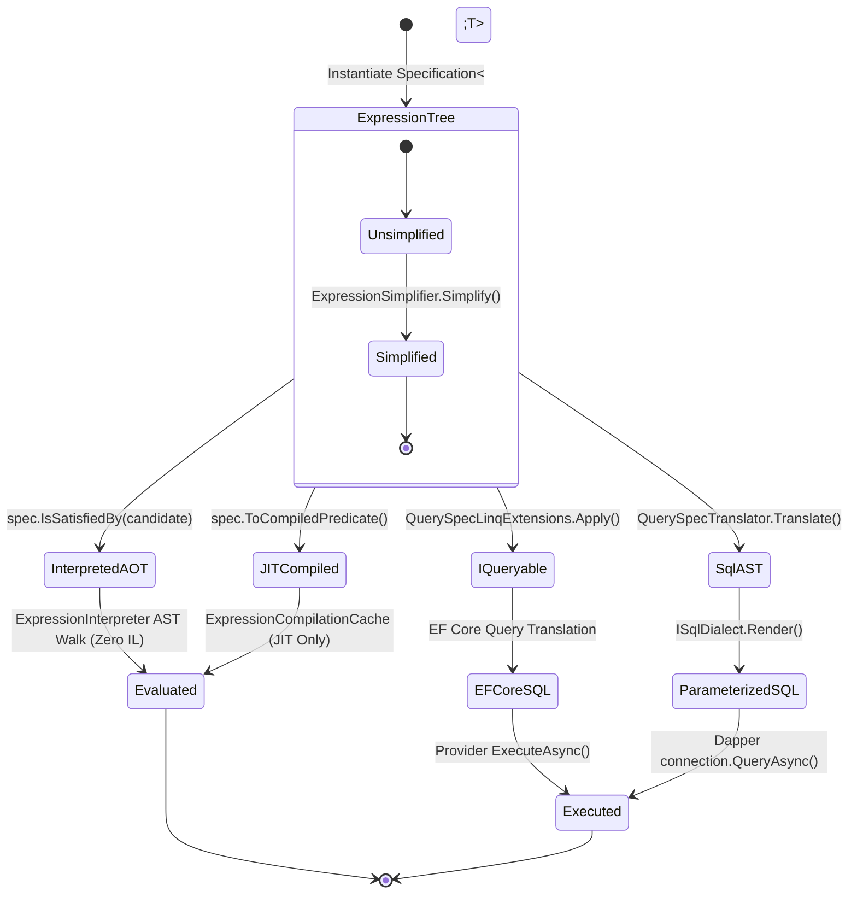

# EricksonLopez.Specification

High-performance, composable, NativeAOT-first Specification Pattern and SQL AST translation ecosystem for modern .NET.

[](https://github.com/ericksonlopezf/dotnet-specification/actions)
[](https://codecov.io/gh/ericksonlopezf/dotnet-specification)
[](https://sonarcloud.io/summary/new_code?id=ericksonlopezf_dotnet-specification)
[](https://github.com/ericksonlopezf/dotnet-specification/blob/main/docs/audit/final-audit.md)
[](https://www.nuget.org/packages/EricksonLopez.Specification)
[](https://www.nuget.org/packages/EricksonLopez.Specification)
[](https://github.com/ericksonlopezf/dotnet-specification/blob/main/LICENSE)
[](https://dotnet.microsoft.com)
[](https://github.com/ericksonlopezf/dotnet-specification/blob/main/docs/aot.md)

---

**EricksonLopez.Specification** is an enterprise-grade, **AOT-first**, provider-agnostic **Specification Pattern** and **SQL AST translation engine** targeting **.NET 8, .NET 9, and .NET 10**. Engineered from the ground up for strict Domain-Driven Design (DDD) layering, it eliminates runtime code generation crashes under NativeAOT via a dedicated in-memory AST interpreter (`ExpressionInterpreter`), translates LINQ expressions directly into parameterized SQL across 6 database dialects without ORM dependencies for Dapper, and enforces immutability, thread-safety, and domain purity at compile time through 11 custom Roslyn analyzers.

---

## Table of Contents

- [What Problem It Solves](#-what-problem-it-solves)
- [Key Features](#-key-features)
- [Ecosystem](#-ecosystem)
- [Documentation](#-documentation)
  - [Step-by-Step Interactive Showcase (Levels 00 to 10)](#-step-by-step-interactive-showcase-levels-00-to-10)
  - [Technical Reference & Architecture Guides](#-technical-reference--architecture-guides)
- [Installation](#-installation)
- [Quick Start](#-quick-start)
  - [1. Define a Pure Domain Specification](#1-define-a-pure-domain-specification)
  - [2. In-Memory Evaluation & Composition (AOT-Safe)](#2-in-memory-evaluation--composition-aot-safe)
  - [3. Build an Immutable Query Descriptor (Application Layer)](#3-build-an-immutable-query-descriptor-application-layer)
  - [4. Execute via Entity Framework Core (LINQ Adapter)](#4-execute-via-entity-framework-core-linq-adapter)
  - [5. Execute via Dapper (Direct Parameterized SQL Generation)](#5-execute-via-dapper-direct-parameterized-sql-generation)
- [Core Use Cases](#-core-use-cases)
  - [Use Case 1: Clean Architecture / CQRS Query Handler with Repository Pattern](#use-case-1-clean-architecture--cqrs-query-handler-with-repository-pattern)
  - [Use Case 2: Multi-Step Domain Rule Composition with Short-Circuiting](#use-case-2-multi-step-domain-rule-composition-with-short-circuiting)
  - [Use Case 3: Keyset / Cursor Pagination on High-Volume Datasets](#use-case-3-keyset--cursor-pagination-on-high-volume-datasets)
  - [Use Case 4: NativeAOT Microservices with Interpreted Validation](#use-case-4-nativeaot-microservices-with-interpreted-validation)
  - [Use Case 5: Multi-Dialect SQL Generation for Dapper & Raw ADO.NET](#use-case-5-multi-dialect-sql-generation-for-dapper--raw-adonet)
  - [Use Case 6: Functional Result Queries with `EricksonLopez.Result`](#use-case-6-functional-result-queries-with-ericksonlopezresult)
- [Configuration & Integrations](#-configuration--integrations)
  - [Entity Framework Core & Dependency Injection](#entity-framework-core--dependency-injection)
  - [Dapper & Dialect Configuration](#dapper--dialect-configuration)
  - [MongoDB Driver Integration](#mongodb-driver-integration)
  - [OpenTelemetry Metrics & Diagnostics](#opentelemetry-metrics--diagnostics)
  - [Compile-Time Roslyn Analyzers (`SPEC001`–`SPEC011`)](#compile-time-roslyn-analyzers-spec001spec011)
- [Testing & Quality](#-testing--quality)
  - [In-Memory Unit Testing](#in-memory-unit-testing)
  - [SQL Translation Snapshot Verification](#sql-translation-snapshot-verification)
  - [Mutation Testing & Quality Score](#mutation-testing--quality-score)
- [Performance Benchmarks](#-performance-benchmarks)
  - [Primary Operations & Composition](#primary-operations--composition)
  - [In-Memory Evaluation Benchmark (AOT vs JIT)](#in-memory-evaluation-benchmark-aot-vs-jit)
  - [SQL AST Translation Benchmark](#sql-ast-translation-benchmark)
  - [LINQ Provider Overhead (`QuerySpec.Apply`)](#linq-provider-overhead-queryspecapply)
  - [Span-Based Bulk Predicate Composition (`AndAll`)](#span-based-bulk-predicate-composition-andall)
- [Compatibility & Technical Matrix](#-compatibility--technical-matrix)
  - [Runtime & Target Framework Matrix](#runtime--target-framework-matrix)
  - [SQL Dialects Feature Matrix](#sql-dialects-feature-matrix)
- [Architecture & Design Principles](#-architecture--design-principles)
  - [System Flow & Layer Boundaries](#system-flow--layer-boundaries)
  - [Expression Lifecycle State Machine](#expression-lifecycle-state-machine)
- [Best Practices & Anti-Patterns](#-best-practices--anti-patterns)
- [Troubleshooting & Common Pitfalls](#-troubleshooting--common-pitfalls)
- [Part of the EricksonLopez Ecosystem](#-part-of-the-ericksonlopez-ecosystem)
- [Contributing](#-contributing)
- [License](#-license)

---

## 🎯 What Problem It Solves

### The Pain Points of Traditional Specification Libraries

1. **NativeAOT Runtime Failures & Dynamic Code Crashes**: Traditional libraries rely heavily on `Expression.Compile()` or runtime IL generation (`System.Reflection.Emit`) for in-memory predicate evaluation. Under NativeAOT or trimmed deployments, these dynamic paths throw runtime exceptions or fail trimming verification.
2. **ORM Coupling & Architectural Leakage in Domain Layers**: Legacy implementations bundle ORM concepts (`Include`, `ThenInclude`, `AsNoTracking`, split queries) directly into domain specification base classes. This violates Clean Architecture principles, pollutes domain entities with infrastructure details, and makes domain logic unusable outside Entity Framework.
3. **Lack of Provider-Agnostic SQL Generation for Micro-ORMs**: Developers wanting high performance with Dapper or raw ADO.NET are forced to manually write string-based SQL queries, discarding domain specifications and introducing SQL injection vulnerabilities and maintainability nightmares.
4. **Mutable State & `Expression.Invoke` Provider Failures**: Combining expressions using `Expression.Invoke` breaks query translation in EF Core, Cosmos DB, and LINQ providers, requiring fragile third-party extensions like LinqKit that fail NativeAOT trimming.

### How `EricksonLopez.Specification` Solves This

- **Dual-Engine Architecture (100% NativeAOT Safe)**: Features a dedicated `ExpressionInterpreter` that evaluates expression ASTs in memory in just **44.6 nanoseconds** without emitting dynamic IL, while preserving an opt-in structural JIT cache (`ExpressionCompilationCache`) for standard runtimes.
- **Strict DDD Layer Separation**: Domain specifications (`Specification<T>`) are strictly pure predicate expressions. Query concerns (sorting, keyset pagination, projection, tracking hints) are isolated in the Application layer via immutable value descriptors (`QuerySpec<T>`).
- **Direct AST-to-SQL Translation**: Translates expression trees into parameterized SQL AST models (`QueryModel`) and renders them across 6 production dialects (**PostgreSQL, SQL Server, MySQL, MariaDB, SQLite, Oracle**) for zero-overhead Dapper execution.
- **Parameter Rebinding without `Expression.Invoke`**: The internal `ParameterReplacer` and `ExpressionComposer` rewrite expression parameters in a single pass, guaranteeing 100% compatibility with LINQ providers and SQL translators.
- **Compile-Time Architecture Governance**: 11 custom Roslyn Analyzers (`SPEC001`–`SPEC011`) flag mutable specifications, missing pagination, un-translatable methods, and legacy Ardalis patterns during compilation.

---

## ⚡ Key Features

- 🚀 **NativeAOT & Trimming First**: Fully verified under .NET 8, 9, and 10 NativeAOT compilers with explicit BCL linker attributes and zero dynamic IL emission on hot paths.
- 🗄️ **Multi-Dialect SQL Generation**: Native parameterized AST rendering for PostgreSQL, SQL Server (`MsSql`), MySQL, MariaDB, SQLite, and Oracle Database without ORM dependencies.
- 🧱 **Strict DDD Clean Architecture**: Pure domain rules in `Specification<T>`, immutable query descriptors in `QuerySpec<T>`, and repository adapters in Infrastructure.
- ⚡ **Zero Allocations on Hot Paths**: Bounded LRU query plan caching (`QueryPlanCache`), structural expression hashing (`ExpressionHasher`), and `ReadOnlySpan<T>` bulk composition (`AndAll` / `OrAny`).
- 🔍 **Keyset & Offset Pagination**: First-class support for both high-throughput deterministic keyset seek (`SeekAfter` / `SeekBefore`) and classic offset pagination (`Page` / `Skip` / `Take`).
- 🛡️ **Compile-Time Roslyn Governance**: 11 analyzers (`SPEC001`–`SPEC011`) with automated CodeFix providers to prevent architectural drift and maintain strict domain purity.
- 📊 **Enterprise Observability**: Integrated OpenTelemetry `ActivitySource` and `Meter` instruments tracking specification evaluations, compositions, and SQL translations.

---

## 📦 Ecosystem

The `EricksonLopez.Specification` ecosystem is organized into modular, fine-grained packages following strict Clean Architecture boundaries:

| Package | Version | Description |
|---|---|---|
| [`EricksonLopez.Specification.Abstractions`](https://www.nuget.org/packages/EricksonLopez.Specification.Abstractions) | [](https://www.nuget.org/packages/EricksonLopez.Specification.Abstractions) | Core contracts: `ISpecification<T>`, `QuerySpec<T>`, `IReadRepository<T>`, `OrderClause<T>` |
| [`EricksonLopez.Specification`](https://www.nuget.org/packages/EricksonLopez.Specification) | [](https://www.nuget.org/packages/EricksonLopez.Specification) | Core engine: `Specification<T>`, `Spec` factory, `ExpressionComposer`, `ExpressionInterpreter` (AOT), `ExpressionSimplifier` |
| [`EricksonLopez.Specification.Linq`](https://www.nuget.org/packages/EricksonLopez.Specification.Linq) | [](https://www.nuget.org/packages/EricksonLopez.Specification.Linq) | LINQ provider adapter for `IQueryable<T>.Apply(querySpec)`, `Any(spec)`, and `Count(spec)` |
| [`EricksonLopez.Specification.Sql`](https://www.nuget.org/packages/EricksonLopez.Specification.Sql) | [](https://www.nuget.org/packages/EricksonLopez.Specification.Sql) | AST-based Expression-to-SQL translator (`QuerySpecTranslator<T>`), `QueryModel`, `ISqlDialect`, bounded `QueryPlanCache` |
| [`EricksonLopez.Specification.PostgreSql`](https://www.nuget.org/packages/EricksonLopez.Specification.PostgreSql) | [](https://www.nuget.org/packages/EricksonLopez.Specification.PostgreSql) | PostgreSQL dialect (`PostgreSqlDialect`: double quotes, `$n` parameters, `LIMIT/OFFSET`, collection predicates) |
| [`EricksonLopez.Specification.MsSql`](https://www.nuget.org/packages/EricksonLopez.Specification.MsSql) | [](https://www.nuget.org/packages/EricksonLopez.Specification.MsSql) | Microsoft SQL Server dialect (`MsSqlDialect`: bracket quoting, `@pn` parameters, `TOP N`, `OFFSET...FETCH`) |
| [`EricksonLopez.Specification.MySql`](https://www.nuget.org/packages/EricksonLopez.Specification.MySql) | [](https://www.nuget.org/packages/EricksonLopez.Specification.MySql) | MySQL dialect (`MySqlDialect`: backtick quoting, `@pn` parameters, `LIMIT/OFFSET`, expanded `IN`) |
| [`EricksonLopez.Specification.MariaDb`](https://www.nuget.org/packages/EricksonLopez.Specification.MariaDb) | [](https://www.nuget.org/packages/EricksonLopez.Specification.MariaDb) | MariaDB dialect (`MariaDbDialect`: backtick quoting, `@pn` parameters, `LIMIT/OFFSET`, expanded `IN`) |
| [`EricksonLopez.Specification.Sqlite`](https://www.nuget.org/packages/EricksonLopez.Specification.Sqlite) | [](https://www.nuget.org/packages/EricksonLopez.Specification.Sqlite) | SQLite dialect (`SqliteDialect`: double quote quoting, `@pn` parameters, `LIMIT/OFFSET`) |
| [`EricksonLopez.Specification.Oracle`](https://www.nuget.org/packages/EricksonLopez.Specification.Oracle) | [](https://www.nuget.org/packages/EricksonLopez.Specification.Oracle) | Oracle Database dialect (`OracleDialect`: double quotes, `:pn` positional parameters, `OFFSET...FETCH`) |
| [`EricksonLopez.Specification.Dapper`](https://www.nuget.org/packages/EricksonLopez.Specification.Dapper) | [](https://www.nuget.org/packages/EricksonLopez.Specification.Dapper) | High-performance Dapper extension methods over `IDbConnection` (`QueryAsync`, `CountAsync`, `AnyAsync`) |
| [`EricksonLopez.Specification.EntityFrameworkCore`](https://www.nuget.org/packages/EricksonLopez.Specification.EntityFrameworkCore) | [](https://www.nuget.org/packages/EricksonLopez.Specification.EntityFrameworkCore) | Entity Framework Core `IReadRepository<T>` implementation, evaluators, and DI extensions |
| [`EricksonLopez.Specification.MongoDB`](https://www.nuget.org/packages/EricksonLopez.Specification.MongoDB) | [](https://www.nuget.org/packages/EricksonLopez.Specification.MongoDB) | MongoDB C# Driver integration (`MongoFilterCompiler`, `MongoSortCompiler`, `MongoSpecificationExtensions`) |
| [`EricksonLopez.Specification.DapperExtensions`](https://www.nuget.org/packages/EricksonLopez.Specification.DapperExtensions) | [](https://www.nuget.org/packages/EricksonLopez.Specification.DapperExtensions) | Execution adapter over internal `EricksonLopez.DapperExtensions` Unit-of-Work & session tracking |
| [`EricksonLopez.Specification.Result`](https://www.nuget.org/packages/EricksonLopez.Specification.Result) | [](https://www.nuget.org/packages/EricksonLopez.Specification.Result) | Functional `Result<T>` query extensions over `IReadRepository<T>` using `EricksonLopez.Result` |
| [`EricksonLopez.Specification.Analyzers`](https://www.nuget.org/packages/EricksonLopez.Specification.Analyzers) | [](https://www.nuget.org/packages/EricksonLopez.Specification.Analyzers) | Roslyn diagnostic analyzers `SPEC001`–`SPEC011` & automated CodeFix providers |
| [`EricksonLopez.Specification.Generators`](https://www.nuget.org/packages/EricksonLopez.Specification.Generators) | [](https://www.nuget.org/packages/EricksonLopez.Specification.Generators) | Roslyn source generator for zero-reflection column resolvers (`[SpecColumnResolver]`) and ordering helpers |

---

## 📚 Documentation

> 🌐 **Official Documentation Hub:** [https://github.com/ericksonlopezf/dotnet-specification/tree/main/docs](https://github.com/ericksonlopezf/dotnet-specification/tree/main/docs)

### 🎓 Step-by-Step Interactive Showcase (Levels 00 to 10)

Explore progressive runnable showcase levels located in the test and sample harness:

| Level | Topic | Description |
|---|---|---|
| [**Level 00**](https://github.com/ericksonlopezf/dotnet-specification/blob/main/samples/Showcase/Levels/Level0_Conceptual.cs) | **Architecture & Conceptual Foundations** | Pure DDD specification principles, expression tree encapsulation, and boundary invariants |
| [**Level 01**](https://github.com/ericksonlopezf/dotnet-specification/blob/main/samples/Showcase/Levels/Level1_QuickStart.cs) | **Quick Start & Domain Primitives** | Sealed specifications, `Spec.For<T>`, `Spec.True<T>`, and in-memory AOT evaluation |
| [**Level 02**](https://github.com/ericksonlopezf/dotnet-specification/blob/main/samples/Showcase/Levels/Level2_Configuration.cs) | **Configuration & SQL Dialects** | Configuring PostgreSQL, SQL Server, MySQL, SQLite, and Oracle AST translators |
| [**Level 03**](https://github.com/ericksonlopezf/dotnet-specification/blob/main/samples/Showcase/Levels/Level3_RealUseCases.cs) | **Real-World Enterprise Use Cases** | CQRS queries, compound domain rules, multi-condition validation, and business pipelines |
| [**Level 04**](https://github.com/ericksonlopezf/dotnet-specification/blob/main/samples/Showcase/Levels/Level4_AdvancedIntegration.cs) | **Advanced ORM & Database Integrations** | EF Core `IQueryable.Apply`, Dapper parameterized execution, and keyset seek pagination |
| [**Level 05**](https://github.com/ericksonlopezf/dotnet-specification/blob/main/samples/Showcase/Levels/Level5_Processing.cs) | **Processing & AST Translation Pipeline** | Expression AST visitor rewriting, parameter replacement, and boolean constant folding |
| [**Level 06**](https://github.com/ericksonlopezf/dotnet-specification/blob/main/samples/Showcase/Levels/Level6_ErrorHandling.cs) | **Error Handling & Invariant Enforcement** | Null safety, un-translatable expression handling, and Roslyn diagnostic enforcement |
| [**Level 07**](https://github.com/ericksonlopezf/dotnet-specification/blob/main/samples/Showcase/Levels/Level7_Scalability.cs) | **Scalability & Bounded LRU Caching** | High-throughput query plan caching (`QueryPlanCache`) and structural expression hashing |
| [**Level 08**](https://github.com/ericksonlopezf/dotnet-specification/blob/main/samples/Showcase/Levels/Level8_Customization.cs) | **Customization & Custom Column Resolvers** | Custom `IColumnNameResolver` strategies and source-generated `[SpecColumnResolver]` |
| [**Level 09**](https://github.com/ericksonlopezf/dotnet-specification/blob/main/samples/Showcase/Levels/Level9_Extensions.cs) | **Ecosystem Extensions (Result & MongoDB)** | Railway-oriented `Result<T>` query integration and MongoDB Filter/Sort compilation |
| [**Level 10**](https://github.com/ericksonlopezf/dotnet-specification/blob/main/samples/Showcase/Levels/Level10_EnterpriseArchitecture.cs) | **Enterprise Architecture & Domain Isolation** | Strict Clean Architecture layer isolation, dependency rule enforcement, and microservice patterns |

### 📖 Technical Reference & Architecture Guides

- [**System Architecture Overview**](https://github.com/ericksonlopezf/dotnet-specification/blob/main/docs/system-overview.md) — Comprehensive architectural blueprint, memory layouts, and clean layering boundaries.
- [**Architectural Decision Records (ADRs)**](https://github.com/ericksonlopezf/dotnet-specification/tree/main/docs/adr) — 28 official ADRs documenting design rationale, structural tradeoffs, and rejected proposals.
- [**Features & Technical Matrix**](https://github.com/ericksonlopezf/dotnet-specification/blob/main/docs/features.md) — Detailed feature classification, tier boundaries, and verified competitor comparisons.
- [**NativeAOT & Trimming Guide**](https://github.com/ericksonlopezf/dotnet-specification/blob/main/docs/aot.md) — Linker attributes, AST interpreter node support, and zero-dynamic-code deployment rules.
- [**Verified Performance Benchmarks**](https://github.com/ericksonlopezf/dotnet-specification/blob/main/docs/benchmarks.md) — BenchmarkDotNet suite results across expression composition, in-memory validation, and SQL translation.
- [**Enterprise Cookbook & Recipes**](https://github.com/ericksonlopezf/dotnet-specification/blob/main/docs/cookbook.md) — 27 production-ready copy-paste recipes for DDD, EF Core, Dapper, NativeAOT, and OpenTelemetry.
- [**Best Practices & Anti-Patterns**](https://github.com/ericksonlopezf/dotnet-specification/blob/main/docs/best-practices.md) — Architectural rules, coding guidelines, and analyzer diagnostic compliance.
- [**Competitive Audit & Matrix**](https://github.com/ericksonlopezf/dotnet-specification/blob/main/docs/competitive-matrix.md) — In-depth technical comparison against Ardalis.Specification, LinqKit, and native EF Core.
- [**Migration from Ardalis.Specification**](https://github.com/ericksonlopezf/dotnet-specification/blob/main/docs/migration-from-ardalis.md) — Step-by-step guide and Roslyn automated code fixes for legacy migrations.
- [**Final Quality Audit**](https://github.com/ericksonlopezf/dotnet-specification/blob/main/docs/audit/final-audit.md) — Comprehensive technical audit, Stryker.NET mutation score verification, and quality gates.

---

## 📥 Installation

Install the required packages using the .NET CLI or Visual Studio Package Manager:

### 1. Core Packages (Domain & Application Layers)

```bash
# Core contracts and immutable query descriptors (zero dependencies)
dotnet add package EricksonLopez.Specification.Abstractions

# Core specification engine, composite combinators, and AOT interpreter
dotnet add package EricksonLopez.Specification
```

### 2. Database Dialects & Providers (Infrastructure Layer — Dapper / SQL)

```bash
# AST-to-SQL translation engine and Dapper execution extensions
dotnet add package EricksonLopez.Specification.Sql
dotnet add package EricksonLopez.Specification.Dapper

# Install your target database dialect:
dotnet add package EricksonLopez.Specification.PostgreSql  # PostgreSQL ($1, $2, LIMIT/OFFSET)
dotnet add package EricksonLopez.Specification.MsSql       # Microsoft SQL Server (TOP, OFFSET FETCH)
dotnet add package EricksonLopez.Specification.MySql       # MySQL (`col`, @p1, LIMIT/OFFSET)
dotnet add package EricksonLopez.Specification.MariaDb     # MariaDB (`col`, @p1, LIMIT/OFFSET)
dotnet add package EricksonLopez.Specification.Sqlite      # SQLite ("col", @p1, LIMIT/OFFSET)
dotnet add package EricksonLopez.Specification.Oracle      # Oracle Database (:p1, OFFSET FETCH)
```

### 3. ORM & Document Database Adapters (Infrastructure Layer)

```bash
# Entity Framework Core & generic LINQ provider adapter
dotnet add package EricksonLopez.Specification.Linq
dotnet add package EricksonLopez.Specification.EntityFrameworkCore

# MongoDB C# Driver FilterDefinition & SortDefinition compiler
dotnet add package EricksonLopez.Specification.MongoDB
```

### 4. Compile-Time Governance & Source Generators (Development Only)

```bash
# Roslyn analyzers (SPEC001–SPEC011) and automated CodeFix providers
dotnet add package EricksonLopez.Specification.Analyzers

# Incremental Source Generator for zero-reflection column resolvers
dotnet add package EricksonLopez.Specification.Generators
```

---

## 🚀 Quick Start

### 1. Define a Pure Domain Specification

Domain specifications represent pure business rules. They are immutable, stateless, sealed, and have zero dependencies on ORMs or database drivers.

```csharp
using System.Linq.Expressions;
using EricksonLopez.Specification;

namespace MyProject.Domain.Specifications;

// Domain layer — pure, stateless, sealed (enforced by SPEC001 analyzer)
public sealed class ActivePremiumCustomerSpec : Specification<Customer>
{
    private readonly decimal _minimumPurchases;

    public ActivePremiumCustomerSpec(decimal minimumPurchases = 1_000m)
        => _minimumPurchases = minimumPurchases;

    protected override Expression<Func<Customer, bool>> BuildExpression()
        => c => c.IsActive && c.TotalPurchases >= _minimumPurchases && c.DeletedAt == null;
}
```

### 2. In-Memory Evaluation & Composition (AOT-Safe)

Evaluate candidates directly in memory without emitting dynamic IL code, or compose multiple business rules using logical combinators:

```csharp
using EricksonLopez.Specification;

var activeSpec = new ActivePremiumCustomerSpec(minimumPurchases: 500m);
var candidate = new Customer { IsActive = true, TotalPurchases = 750m, DeletedAt = null };

// 100% NativeAOT-safe in-memory evaluation (evaluated via ExpressionInterpreter in ~44.6 ns)
bool isEligible = activeSpec.IsSatisfiedBy(candidate);

// Fluent predicate composition without Expression.Invoke (inlinable by SQL translators)
var verifiedEmailSpec = Spec.For<Customer>(c => c.IsEmailVerified);
var highRiskSpec = Spec.For<Customer>(c => c.RiskScore > 80);

var qualifiedPromoSpec = activeSpec
    .And(verifiedEmailSpec)
    .And(highRiskSpec.Not());

// Bulk composition using static combinators
Specification<Customer> allRules = Spec.All(
    new ActivePremiumCustomerSpec(),
    Spec.For<Customer>(c => c.CountryCode == "US"),
    Spec.For<Customer>(c => c.CreditLimit > 0m)
);
```

### 3. Build an Immutable Query Descriptor (Application Layer)

Use `QuerySpec<T>` in Application layer handlers to encapsulate filtering, sorting, pagination, and projection as an immutable value record:

```csharp
using EricksonLopez.Specification;

// Application layer — immutable query descriptor
var querySpec = QuerySpec<Customer>.Empty
    .Where(new ActivePremiumCustomerSpec(1_000m)) // Accepts IExpressionSpecification<T>
    .Where(c => c.CountryCode == "US")           // Or inline lambda criteria
    .OrderByDescending(c => c.TotalPurchases)
    .ThenBy(c => c.Name)
    .Page(page: 1, pageSize: 25)
    .TagWith("Handler:GetTopCustomersQuery");
```

### 4. Execute via Entity Framework Core (LINQ Adapter)

Apply query specifications directly to any EF Core `IQueryable<T>` without leaking ORM concerns into your domain layer:

```csharp
using Microsoft.EntityFrameworkCore;
using EricksonLopez.Specification.Linq;

// Seamlessly applies WHERE predicates, ORDER BY, SKIP, TAKE, and query tags
List<Customer> topCustomers = await dbContext.Customers
    .Apply(querySpec)
    .ToListAsync(cancellationToken);
```

### 5. Execute via Dapper (Direct Parameterized SQL Generation)

Translate domain specifications into high-performance, injection-safe parameterized SQL without requiring an ORM:

```csharp
using EricksonLopez.Specification.Sql;
using EricksonLopez.Specification.PostgreSql;
using EricksonLopez.Specification.Dapper;

// 1. Initialize translator with table name and column naming strategy
var translator = new QuerySpecTranslator<Customer>("customers", new SnakeCaseColumnNameResolver());

// 2. Select target dialect (PostgreSQL, SQL Server, MySQL, SQLite, Oracle)
var dialect = PostgreSqlDialect.Default;

// 3. Execute directly over any standard IDbConnection via Dapper extension
IEnumerable<Customer> results = await dbConnection.QueryAsync(
    querySpec, 
    translator, 
    dialect, 
    cancellationToken: cancellationToken
);

// Generated SQL:
// SELECT * FROM "customers" 
// WHERE "is_active" = $1 AND "total_purchases" >= $2 AND "deleted_at" IS NULL AND "country_code" = $3 
// ORDER BY "total_purchases" DESC, "name" ASC 
// LIMIT $4 OFFSET $5
```

---

## 💡 Core Use Cases

### Use Case 1: Clean Architecture / CQRS Query Handler with Repository Pattern

Encapsulate data retrieval in CQRS query handlers using `IReadRepository<T>` without coupling application logic to specific database technologies:

```csharp
using EricksonLopez.Specification;

public sealed record GetActiveVipCustomersQuery(decimal MinPurchases, int Page, int PageSize) 
    : IRequest<IReadOnlyList<CustomerDto>>;

public sealed class GetActiveVipCustomersQueryHandler 
    : IRequestHandler<GetActiveVipCustomersQuery, IReadOnlyList<CustomerDto>>
{
    private readonly IReadRepository<Customer> _repository;

    public GetActiveVipCustomersQueryHandler(IReadRepository<Customer> repository)
        => _repository = repository;

    public async Task<IReadOnlyList<CustomerDto>> Handle(
        GetActiveVipCustomersQuery request, 
        CancellationToken cancellationToken)
    {
        var spec = QuerySpec<Customer, CustomerDto>.Empty
            .Where(new ActivePremiumCustomerSpec(request.MinPurchases))
            .OrderByDescending(c => c.TotalPurchases)
            .Page(request.Page, request.PageSize)
            .Select(c => new CustomerDto(c.Id, c.Name, c.TotalPurchases));

        return await _repository.ListAsync(spec, cancellationToken);
    }
}
```

### Use Case 2: Multi-Step Domain Rule Composition with Short-Circuiting

Dynamically assemble complex business rules across domain services with automatic boolean constant folding:

```csharp
public sealed class LoanEligibilityService
{
    public bool EvaluateEligibility(Customer customer, LoanApplication application)
    {
        Specification<Customer> rules = new MinimumAgeSpec(minAge: 21)
            .And(new VerifiedIdentitySpec())
            .And(new DebtToIncomeRatioSpec(maxRatio: 0.43m));

        if (application.RequiresCollateral)
        {
            rules = rules.And(new VerifiedCollateralSpec(application.RequestedAmount));
        }

        // Evaluates in-memory with automatic short-circuit semantics
        return rules.IsSatisfiedBy(customer);
    }
}
```

### Use Case 3: Keyset / Cursor Pagination on High-Volume Datasets

Prevent slow SQL `OFFSET` table scans on massive datasets using deterministic keyset seek pagination:

```csharp
// Forward pagination (Next Page after specific cursor ID)
var nextBatchQuery = QuerySpec<Order>.Empty
    .Where(o => o.Status == OrderStatus.Completed)
    .OrderByDescending(o => o.Id)
    .SeekAfter(o => o.Id, cursorValue: 1_084_250L, take: 50);

// Generates: WHERE status = @p1 AND id < @cursor ORDER BY id DESC LIMIT 50
var orders = await _readRepository.ListAsync(nextBatchQuery, cancellationToken);
```

### Use Case 4: NativeAOT Microservices with Interpreted Validation

Deploy lightweight containerized microservices and serverless functions under NativeAOT with zero reflection warnings:

```csharp
[DapperAot]
public partial class MicroserviceDapperContext : IDapperContext;

// 100% NativeAOT: In-memory evaluation uses interpreted AST walk
var fraudCheck = new NonFlaggedAccountSpec().And(new IpReputationSpec("US"));
if (!fraudCheck.IsSatisfiedBy(account))
{
    return Results.Forbid();
}

// Database query rendered via compile-time source generated column resolvers
var results = await connection.QueryAsync(querySpec, aotTranslator, PostgreSqlDialect.Default);
```

### Use Case 5: Multi-Dialect SQL Generation for Dapper & Raw ADO.NET

Execute identical business specifications across heterogeneous database engines:

```csharp
var spec = new ActivePremiumCustomerSpec().ToQuerySpec().Page(1, 10);
var translator = new QuerySpecTranslator<Customer>("Customers");

// PostgreSQL: SELECT * FROM "Customers" WHERE ... LIMIT 10 OFFSET 0
var pgQuery = PostgreSqlDialect.Default.Render(translator.Translate(spec));

// SQL Server: SELECT * FROM [Customers] WHERE ... OFFSET 0 ROWS FETCH NEXT 10 ROWS ONLY
var msSqlQuery = MsSqlDialect.Default.Render(translator.Translate(spec));

// MySQL: SELECT * FROM `Customers` WHERE ... LIMIT 10 OFFSET 0
var mySqlQuery = MySqlDialect.Default.Render(translator.Translate(spec));

// Oracle: SELECT * FROM "Customers" WHERE ... OFFSET 0 ROWS FETCH NEXT 10 ROWS ONLY
var oracleQuery = OracleDialect.Default.Render(translator.Translate(spec));
```

### Use Case 6: Functional Result Queries with `EricksonLopez.Result`

Integrate Railway-Oriented Programming for resilient, exception-free repository queries:

```csharp
using EricksonLopez.Result;
using EricksonLopez.Specification.Result;

// Returns Result<Customer> instead of throwing exceptions on missing entities
Result<Customer> customerResult = await repository.FirstOrDefaultResultAsync(
    QuerySpec<Customer>.Empty.Where(c => c.Email == requestEmail),
    cancellationToken
);

return customerResult.Match(
    onSuccess: customer => Results.Ok(customer),
    onFailure: error => Results.NotFound(error.Message)
);
```

---

## 🔌 Configuration & Integrations

### Entity Framework Core & Dependency Injection

Register the EF Core specification evaluator and generic read repositories in your `IServiceCollection`:

```csharp
using Microsoft.Extensions.DependencyInjection;
using EricksonLopez.Specification.EntityFrameworkCore;

public static void ConfigureServices(IServiceCollection services, IConfiguration configuration)
{
    services.AddDbContext<AppDbContext>(options =>
        options.UseNpgsql(configuration.GetConnectionString("PostgresDb")));

    // Registers IReadRepository<T> and ISpecificationEvaluator backed by EF Core
    services.AddSpecificationEntityFramework<AppDbContext>();

    // Or register explicit typed read repository:
    services.AddEfReadRepository<AppDbContext, Customer>();
}
```

### Dapper & Dialect Configuration

Optimize SQL generation with compile-time source-generated column resolvers:

```csharp
using EricksonLopez.Specification.Generators;
using EricksonLopez.Specification.PostgreSql;
using EricksonLopez.Specification.Sql;

// 1. Declare source-generated column resolver (eliminates runtime reflection)
[SpecColumnResolver(typeof(Customer), Convention = NamingConvention.SnakeCase)]
public sealed partial class CustomerColumnResolver;

// 2. Register translator in DI as singleton
services.AddSingleton(new QuerySpecTranslator<Customer>("customers", new CustomerColumnResolver()));
services.AddSingleton<ISqlDialect>(PostgreSqlDialect.Default);
```

### MongoDB Driver Integration

Compile specification expressions directly into native MongoDB `FilterDefinition<T>` and `SortDefinition<T>`:

```csharp
using EricksonLopez.Specification.MongoDB;
using MongoDB.Driver;

var querySpec = QuerySpec<CustomerDoc>.Empty
    .Where(c => c.IsActive && c.Score >= 100)
    .OrderByDescending(c => c.CreatedAt)
    .Page(1, 20);

// Compile to MongoDB native filter and sort definitions
FilterDefinition<CustomerDoc> filter = MongoFilterCompiler.Compile(querySpec);
SortDefinition<CustomerDoc> sort = MongoSortCompiler.Compile(querySpec);

var results = await mongoCollection
    .Find(filter)
    .Sort(sort)
    .Skip(querySpec.Pagination?.Skip)
    .Limit(querySpec.Pagination?.Take)
    .ToListAsync(cancellationToken);
```

### OpenTelemetry Metrics & Diagnostics

Monitor specification evaluations, composition overhead, and SQL translation counts in production:

```csharp
using OpenTelemetry.Metrics;

var meterProvider = Sdk.CreateMeterProviderBuilder()
    .AddMeter("EricksonLopez.Specification")
    .AddPrometheusExporter()
    .Build();

// Automatically recorded metrics:
// - specification.evaluations_total (Counter)
// - specification.compositions_total (Counter)
// - specification.sql_translations_total (Counter)
```

### Compile-Time Roslyn Analyzers (`SPEC001`–`SPEC011`)

The library includes 11 automated analyzers to enforce architectural purity and prevent misuse during compilation:

| Diagnostic ID | Severity | Category | Description | CodeFix Available |
|---|---|---|---|:---:|
| **`SPEC001`** | **Warning** | Architecture | Specification classes must be declared `sealed` or `abstract`. | ✅ Yes |
| **`SPEC002`** | **Warning** | Immutability | Specifications must not contain mutable state, fields, or properties. | ❌ No |
| **`SPEC003`** | **Error** | Correctness | `Expression.Invoke` is prohibited in specification expression trees. | ❌ No |
| **`SPEC004`** | **Info** | Performance | Unbounded query detected; recommend adding `.Take()` or `.Page()`. | ❌ No |
| **`SPEC005`** | **Info** | Correctness | Ordering clause applied without pagination limits. | ❌ No |
| **`SPEC006`** | **Info** | Layering | Domain specification declared outside Domain layer boundary. | ❌ No |
| **`SPEC007`** | **Warning** | SQL Translation | Non-translatable method invocation inside `BuildExpression`. | ❌ No |
| **`SPEC008`** | **Error** | Purity | Prohibits infrastructure dependencies (`DbContext`, `IServiceProvider`) in constructors. | ❌ No |
| **`SPEC009`** | **Error** | Correctness | Disallows `async` lambdas inside `BuildExpression`. | ❌ No |
| **`SPEC010`** | **Error** | Correctness | Disallows calling `IsSatisfiedBy` inside `BuildExpression`. | ❌ No |
| **`SPEC011`** | **Warning** | Migration | Flags inheritance from legacy `Ardalis.Specification` base class. | ✅ Yes |

---

## 🧪 Testing & Quality

### In-Memory Unit Testing

Test pure domain specifications in unit test projects without databases or mocks:

```csharp
using Xunit;
using EricksonLopez.Specification;

public sealed class ActivePremiumCustomerSpecTests
{
    [Fact]
    public void IsSatisfiedBy_WhenCustomerIsActiveAndMeetsPurchases_ReturnsTrue()
    {
        // Arrange
        var spec = new ActivePremiumCustomerSpec(minimumPurchases: 1_000m);
        var customer = new Customer { IsActive = true, TotalPurchases = 1_500m, DeletedAt = null };

        // Act
        bool result = spec.IsSatisfiedBy(customer);

        // Assert
        Assert.True(result);
    }

    [Fact]
    public void IsSatisfiedBy_WhenCustomerIsDeleted_ReturnsFalse()
    {
        // Arrange
        var spec = new ActivePremiumCustomerSpec(minimumPurchases: 1_000m);
        var customer = new Customer { IsActive = true, TotalPurchases = 2_000m, DeletedAt = DateTime.UtcNow };

        // Act
        bool result = spec.IsSatisfiedBy(customer);

        // Assert
        Assert.False(result);
    }
}
```

### SQL Translation Snapshot Verification

Verify AST translation output deterministically:

```csharp
[Fact]
public void Translate_WithFilterAndPaging_GeneratesExpectedPostgreSql()
{
    var spec = QuerySpec<Customer>.Empty
        .Where(c => c.IsActive)
        .OrderByDescending(c => c.CreatedAt)
        .Page(page: 2, pageSize: 10);

    var translator = new QuerySpecTranslator<Customer>("customers", new SnakeCaseColumnNameResolver());
    var model = translator.Translate(spec);
    var sqlQuery = PostgreSqlDialect.Default.Render(model);

    Assert.Equal(
        "SELECT * FROM \"customers\" WHERE \"is_active\" = $1 ORDER BY \"created_at\" DESC LIMIT $2 OFFSET $3",
        sqlQuery.Sql
    );
    Assert.Equal(true, sqlQuery.Parameters["$1"]);
    Assert.Equal(10, sqlQuery.Parameters["$2"]);
    Assert.Equal(10, sqlQuery.Parameters["$3"]);
}
```

### Mutation Testing & Quality Score

Every release undergoes exhaustive mutation testing via **Stryker.NET** to ensure test assertions catch all logic regressions:

- **Mutation Score**: **≥ 99%**
- **Test Invariants**: 100% coverage of boolean folding, parameter rewriting, and dialect rendering nodes.
- **Linker Verification**: Zero trimming warnings under .NET SDK 10.0 NativeAOT compiler.

---

## ⚡ Performance Benchmarks

> **Environment:** .NET 10.0.10 (10.0.1026.32716), X64 RyuJIT AVX-512, Windows 11 Pro, BenchmarkDotNet v0.14.0

### Primary Operations & Composition

Compairing combining predicates (`c => c.IsActive` and `c => !c.IsDeleted`) via `ExpressionComposer.And` versus manual dynamic lambda construction:

| Method | Mean | Ratio | Gen0 | Allocated | Alloc Ratio |
|---|---:|---:|---:|---:|---:|
| **Manual: `x => left && right`** | 184.71 ns | 1.00 | 0.0110 | 560 B | 1.00 |
| **EricksonLopez: `ExpressionComposer.And`** | **93.51 ns** | **0.51** | **0.0088** | **448 B** | **0.80** |
| **EricksonLopez: 5-way `AND` Composition** | 343.08 ns | 1.86 | 0.0343 | 1,736 B | 3.10 |

> **Key Takeaway**: `ExpressionComposer.And` outperforms manual lambda creation by **49% in execution time** and **20% in memory allocation** via single-pass parameter rebinding.

---

### In-Memory Evaluation Benchmark (AOT vs JIT)

Evaluates a composite specification (`ActiveCustomerSpec.And(NotDeletedSpec)`) against a candidate instance:

| Method | Mean | Median | Gen0 | Allocated | Execution Mode |
|---|---:|---:|---:|---:|---|
| **Manual Direct Delegate (JIT Inlined)** | 0.0017 ns | 0.0004 ns | - | - | Direct compiled C# delegate |
| **EricksonLopez: `IsSatisfiedBy` (Interpreted)** | **44.64 ns** | **44.63 ns** | 0.0019 | **96 B** | **100% NativeAOT Safe (Zero Dynamic IL)** |
| **EricksonLopez: `IsSatisfiedBy` (Compiled Cache)** | **64.60 ns** | **64.49 ns** | 0.0010 | **48 B** | JIT Cached Structural Delegate |

> **Key Takeaway**: In-memory interpreted evaluation executes in just **44.6 nanoseconds**, enabling sub-microsecond validation on NativeAOT without dynamic code generation.

---

### SQL AST Translation Benchmark

Measures translating a `QuerySpec<T>` into a parameterized SQL string and parameter dictionary for PostgreSQL:

| Method | Mean | Gen0 | Allocated | Description |
|---|---:|---:|---:|---|
| **EricksonLopez: Simple Spec → SQL** | **108.63 ns** | 0.0225 | 1.11 KB | Single filter (`WHERE is_active = $1`) |
| **EricksonLopez: Complex Spec → SQL** | **412.62 ns** | 0.0634 | 3.13 KB | 3 filters + `ORDER BY` + `LIMIT/OFFSET` |

---

### LINQ Provider Overhead (`QuerySpec.Apply`)

Measures applying a `QuerySpec<T>` with filtering, sorting, and paging against an `IQueryable<T>` data source of 1,000 entities:

| Method | Mean | Ratio | Gen0 | Allocated | Alloc Ratio |
|---|---:|---:|---:|---:|---:|
| **Manual LINQ Query** | 688.7 μs | 1.00 | 0.9766 | 67.96 KB | 1.00 |
| **EricksonLopez: `QuerySpec.Apply`** | **702.2 μs** | **1.02** | 0.9766 | 67.12 KB | **0.99** |

---

### Span-Based Bulk Predicate Composition (`AndAll`)

Bulk composition of 5 predicates using `ReadOnlySpan<T>` versus chained `.And()` invocations:

| Method | Mean | Ratio | Gen0 | Allocated | Alloc Ratio |
|---|---:|---:|---:|---:|---:|
| **Chained `.And()` × 4** | 520.0 ns | 1.00 | 0.0391 | 1.94 KB | 1.00 |
| **`AndAll(ReadOnlySpan)` × 5** | **477.6 ns** | **0.92** | 0.0391 | 1.94 KB | **1.00** |

---

## 🌐 Compatibility & Technical Matrix

### Runtime & Target Framework Matrix

| Package | .NET 8.0 LTS | .NET 9.0 STS | .NET 10.0 | NativeAOT | Trimmable | Linker Notes |
|---|:---:|:---:|:---:|:---:|:---:|---|
| `EricksonLopez.Specification.Abstractions` | ✅ Full | ✅ Full | ✅ Full | ✅ Full | ✅ Full | BCL-only pure contracts |
| `EricksonLopez.Specification` | ✅ Full | ✅ Full | ✅ Full | ✅ Full | ✅ Full | Core AOT safe; JIT cache marked `[RequiresDynamicCode]` |
| `EricksonLopez.Specification.Linq` | ✅ Full | ✅ Full | ✅ Full | ✅ Full | ✅ Full | Passes expressions to LINQ provider |
| `EricksonLopez.Specification.Sql` | ✅ Full | ✅ Full | ✅ Full | ⚠️ Annotated | ✅ Full | Reflection closures annotated `[RequiresUnreferencedCode]` |
| `EricksonLopez.Specification.PostgreSql` | ✅ Full | ✅ Full | ✅ Full | ✅ Full | ✅ Full | Pure AST string renderer |
| `EricksonLopez.Specification.MsSql` | ✅ Full | ✅ Full | ✅ Full | ✅ Full | ✅ Full | Pure AST string renderer |
| `EricksonLopez.Specification.MySql` | ✅ Full | ✅ Full | ✅ Full | ✅ Full | ✅ Full | Pure AST string renderer |
| `EricksonLopez.Specification.MariaDb` | ✅ Full | ✅ Full | ✅ Full | ✅ Full | ✅ Full | Pure AST string renderer |
| `EricksonLopez.Specification.Sqlite` | ✅ Full | ✅ Full | ✅ Full | ✅ Full | ✅ Full | Pure AST string renderer |
| `EricksonLopez.Specification.Oracle` | ✅ Full | ✅ Full | ✅ Full | ✅ Full | ✅ Full | Pure AST string renderer |
| `EricksonLopez.Specification.Dapper` | ✅ Full | ✅ Full | ✅ Full | ✅ Full | ✅ Full | Fully compatible with Dapper.AOT |
| `EricksonLopez.Specification.EntityFrameworkCore` | ✅ Full | ✅ Full | ✅ Full | ✅ Full | ✅ Full | Compatible with EF Core compiled models |
| `EricksonLopez.Specification.MongoDB` | ✅ Full | ✅ Full | ✅ Full | ✅ Full | ✅ Full | Compatible with MongoDB Driver v3+ |
| `EricksonLopez.Specification.Analyzers` | N/A | N/A | N/A | N/A | N/A | Roslyn compile-time only |

### SQL Dialects Feature Matrix

| Dialect | Identifier Quote | Parameter Format | Paging Clause | String Matching | Collection Predicates |
|---|:---:|:---:|---|---|---|
| **PostgreSQL** | `"column"` | `$1, $2, ...` | `LIMIT n OFFSET m` | `LIKE`, `ILIKE` | `= ANY(@p)` |
| **SQL Server** | `[column]` | `@p1, @p2, ...` | `OFFSET m ROWS FETCH NEXT n ROWS ONLY` | `LIKE` | `IN (@p1, @p2)` |
| **MySQL** | `` `column` `` | `@p1, @p2, ...` | `LIMIT n OFFSET m` | `LIKE` | `IN (@p1, @p2)` |
| **MariaDB** | `` `column` `` | `@p1, @p2, ...` | `LIMIT n OFFSET m` | `LIKE` | `IN (@p1, @p2)` |
| **SQLite** | `"column"` | `@p1, @p2, ...` | `LIMIT n OFFSET m` | `LIKE` | `IN (@p1, @p2)` |
| **Oracle** | `"COLUMN"` | `:p1, :p2, ...` | `OFFSET m ROWS FETCH NEXT n ROWS ONLY` | `LIKE` | `IN (:p1, :p2)` |

---

## 🏛️ Architecture & Design Principles

### System Flow & Layer Boundaries

The following diagram illustrates how domain business rules travel from the Domain layer into application query descriptors and execute through LINQ or native SQL infrastructure:

```mermaid
flowchart TD
    %% Architecture Layers
    subgraph Domain["Domain Layer"]
        Spec["Specification&lt;T&gt;"]
        SpecDesc["Encapsulates Pure Predicates as Expressions"]
        Spec --- SpecDesc
    end

    subgraph Application["Application Layer"]
        QuerySpec["QuerySpec&lt;T&gt; / QuerySpec&lt;T, TResult&gt;"]
        QueryDesc["Adds Sorting, Keyset/Offset Paging, & Projection"]
        QuerySpec --- QueryDesc
    end

    subgraph CoreEngine["Specification Engine"]
        Composer["ExpressionComposer (Parameter Replacer)"]
        Simplifier["ExpressionSimplifier (Constant Folding)"]
        Hasher["ExpressionHasher (Structural Equality)"]
    end

    subgraph Infrastructure["Infrastructure Layer"]
        direction LR
        subgraph LinqProvider["LINQ Provider (EF Core)"]
            ApplyExt["QuerySpecLinqExtensions.Apply"]
            IQueryable["IQueryable&lt;T&gt;"]
        end
        subgraph SqlProvider["SQL Provider (Dapper)"]
            Translator["QuerySpecTranslator&lt;T&gt;"]
            QueryModel["QueryModel AST"]
            Dialect["ISqlDialect (PostgreSQL, SQL Server, MySQL, SQLite, Oracle)"]
            SqlQuery["SqlQuery (Parameterized SQL + Parameters)"]
        end
    end

    %% Relationships
    Spec -->|.And() / .Or() / .Not()| Composer
    Composer --> Simplifier
    Simplifier --> QuerySpec
    Spec -->|Direct Where| QuerySpec
    
    QuerySpec -->|LINQ Path| ApplyExt
    ApplyExt --> IQueryable
    IQueryable -->|EF Core Execution| Database[(Database)]

    QuerySpec -->|Native SQL Path| Translator
    Translator -->|Translates to AST| QueryModel
    QueryModel -->|Renders Dialect| Dialect
    Dialect --> SqlQuery
    SqlQuery -->|Executes via Dapper| Database
```

---

### Expression Lifecycle State Machine

The state machine below depicts the transformation of specification expressions through simplification, caching, and multi-path provider execution:



---

## 🛡️ Best Practices & Anti-Patterns

| Scenario | ❌ Avoid | ✅ Recommended |
|---|---|---|
| **Class Declaration** | Declaring unsealed specification classes | Sealing all concrete specifications (`SPEC001`) |
| **Specification State** | Adding mutable fields/properties to specifications | Using readonly constructor parameters captured in closures (`SPEC002`) |
| **Expression Composition** | Using `Expression.Invoke` to combine lambdas | Using `.And()`, `.Or()`, and `ExpressionComposer` (`SPEC003`) |
| **Query Limits** | Executing unbounded queries without pagination | Always applying `.Page()` or `.Take()` on database queries (`SPEC004`) |
| **Ordering & Paging** | Paginating without a deterministic ordering | Specifying `.OrderBy()` before applying pagination clauses (`SPEC005`) |
| **Clean Architecture** | Referencing `DbContext` or `IDbConnection` in Domain specs | Keeping specifications pure and injecting `IReadRepository<T>` in Application (`SPEC008`) |
| **Async Operations** | Using `async` / `await` inside `BuildExpression` | Keeping expression trees pure and executing async in repositories (`SPEC009`) |
| **In-Memory Validation in AOT** | Calling `spec.ToCompiledPredicate()` under NativeAOT | Using `spec.IsSatisfiedBy()` (evaluates via `ExpressionInterpreter`) |
| **High-Volume Pagination** | Using large `OFFSET` values on big tables | Using keyset pagination via `.SeekAfter()` / `.SeekBefore()` |
| **SQL Column Mapping** | Relying on runtime reflection in AOT paths | Using source-generated column resolvers (`[SpecColumnResolver]`) |

---

## ⚠️ Troubleshooting & Common Pitfalls

> [!CAUTION]
> **Domain Invariants & NativeAOT Safety Rules**:
> 1. **Do not use `ToCompiledPredicate()` in NativeAOT**: In NativeAOT runtimes, dynamic IL generation via `Expression.Compile()` throws at runtime. Always use `spec.IsSatisfiedBy(candidate)` which executes safely through `ExpressionInterpreter`.
> 2. **Do not inject infrastructure services into specifications**: Domain specifications represent business rules, not services. Injecting `DbContext`, `IHttpClientFactory`, or `IServiceProvider` triggers compilation error `SPEC008`.
> 3. **Avoid non-translatable C# methods in expressions**: Calling custom C# methods inside `BuildExpression` that cannot be translated to SQL will trigger `SPEC007` and cause LINQ/Dapper provider execution failures.
> 4. **Do not omit ordering when paginating**: SQL engines do not guarantee deterministic result ordering without an explicit `ORDER BY`. Always add `.OrderBy()` when calling `.Page()` or `.Take()`.

---

## 🌐 Part of the EricksonLopez Ecosystem

`EricksonLopez.Specification` is part of the standardized, high-performance .NET enterprise ecosystem:

- 🧱 [**EricksonLopez.SharedKernel**](https://github.com/ericksonlopezf/dotnet-shared-kernel) — Foundational domain primitives, value objects, entity identifiers, and domain event dispatching.
- ⚡ [**EricksonLopez.Result**](https://github.com/ericksonlopezf/dotnet-result) — High-performance, zero-allocation struct-based Result Pattern & Railway-Oriented Programming.
- 🔍 **EricksonLopez.Specification** — Composable, AOT-first Specification Pattern & multi-dialect SQL AST translation.
- 📬 [**EricksonLopez.Mediator**](https://github.com/ericksonlopezf/dotnet-mediator) — Zero-allocation, source-generated mediator and CQRS pipeline engine.
- 🔄 [**EricksonLopez.Concurrency**](https://github.com/ericksonlopezf/dotnet-concurrency) — Resilient asynchronous concurrency primitives, rate limiting, and execution gates.
- 🏢 [**EricksonLopez.MultiTenancy**](https://github.com/ericksonlopezf/dotnet-multitenancy) — High-isolation multitenancy infrastructure with PostgreSQL Row-Level Security (RLS).

---

## 🤝 Contributing

Contributions, bug reports, and pull requests are welcome!

### Local Development Setup

1. **Prerequisites**:
   - [.NET SDK 10.0](https://dotnet.microsoft.com/download) (or .NET SDK 8.0/9.0)
   - [Docker](https://www.docker.com/) (optional, for running integration test database containers)

2. **Clone & Build**:
   ```bash
   git clone https://github.com/ericksonlopezf/dotnet-specification.git
   cd dotnet-specification
   dotnet restore EricksonLopez.Specifications.slnx
   dotnet build EricksonLopez.Specifications.slnx -c Release
   ```

3. **Run Unit Tests**:
   ```bash
   dotnet test EricksonLopez.Specifications.slnx -c Release --no-build
   ```

4. **Run Mutation Testing (Stryker.NET)**:
   ```bash
   dotnet tool restore
   dotnet stryker --config-file-path stryker-config.json
   ```

Please read our [**Contributing Guide**](https://github.com/ericksonlopezf/dotnet-specification/blob/main/CONTRIBUTING.md), [**Code of Conduct**](https://github.com/ericksonlopezf/dotnet-specification/blob/main/CODE_OF_CONDUCT.md), and [**Security Policy**](https://github.com/ericksonlopezf/dotnet-specification/blob/main/SECURITY.md) before submitting pull requests.

---

## 📄 License

Distributed under the [MIT License](https://github.com/ericksonlopezf/dotnet-specification/blob/main/LICENSE). Copyright © 2026 Erickson Lopez.
