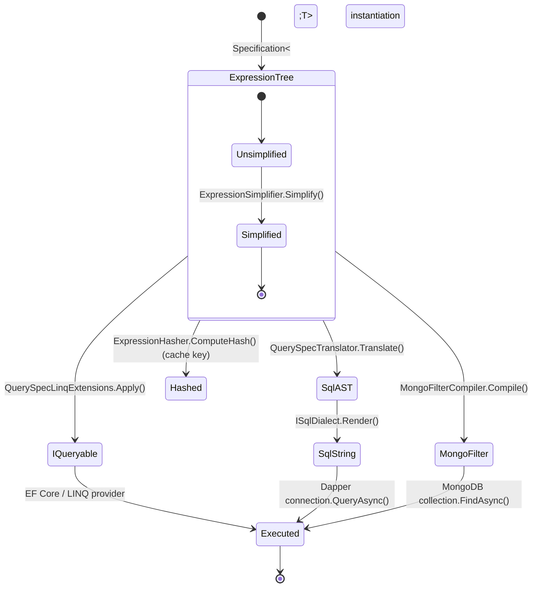

# Architecture — EricksonLopez.Specification

This document describes the architectural design of the `EricksonLopez.Specification` library ecosystem.

> **Core Principle**: A Specification expresses *what* to query. Providers decide *how* to execute it.

---

## 1. Three Non-Negotiable Design Constraints

| Constraint | Consequence |
|---|---|
| **AOT-First** | `ExpressionInterpreter` is the default evaluator. `Expression.Compile()` is opt-in, JIT-only, and annotated `[RequiresDynamicCode]`. |
| **Dapper/SQL-First** | Expression trees translate to parameterized SQL without EF Core. The `Sql` package has zero ORM dependencies. |
| **DDD Correct** | `Specification<T>` is predicate-only (Domain layer). `QuerySpec<T>` carries query concerns (Application layer). They are not the same type. |

---

## 2. Package Dependency Graph

No circular dependencies. Zero upward dependencies. All package references follow strict Clean Architecture layers:

```mermaid
graph TD
    ABS[EricksonLopez.Specification.Abstractions]
    CORE[EricksonLopez.Specification]
    LINQ[EricksonLopez.Specification.Linq]
    SQL[EricksonLopez.Specification.Sql]
    
    PG[EricksonLopez.Specification.PostgreSql]
    MSSQL[EricksonLopez.Specification.MsSql]
    MYSQL[EricksonLopez.Specification.MySql]
    MARIADB[EricksonLopez.Specification.MariaDb]
    SQLITE[EricksonLopez.Specification.Sqlite]
    ORACLE[EricksonLopez.Specification.Oracle]
    
    DAPPER[EricksonLopez.Specification.Dapper]
    EFCORE[EricksonLopez.Specification.EntityFrameworkCore]
    MONGO[EricksonLopez.Specification.MongoDB]
    DAPPEREXT[EricksonLopez.Specification.DapperExtensions]
    RESULT[EricksonLopez.Specification.Result]
    
    ANA[EricksonLopez.Specification.Analyzers]
    GEN[EricksonLopez.Specification.Generators]

    CORE --> ABS
    LINQ --> ABS
    SQL --> CORE
    
    PG --> SQL
    MSSQL --> SQL
    MYSQL --> SQL
    MARIADB --> SQL
    SQLITE --> SQL
    ORACLE --> SQL
    
    DAPPER --> SQL
    EFCORE --> ABS
    EFCORE --> LINQ
    MONGO --> ABS
    MONGO --> LINQ
    DAPPEREXT --> CORE
    DAPPEREXT --> SQL
    RESULT --> ABS

    ANA -.->|Build-Time Analysis| ABS
    GEN -.->|Build-Time Generation| ABS
```



---

## 3. Layer Mapping (Clean Architecture)

```mermaid
flowchart TD
    subgraph Domain["Domain Layer"]
        Spec["Specification&lt;T&gt;\n(pure predicate)"]
        SpecFactory["Spec.For / Spec.True / Spec.False"]
    end

    subgraph Application["Application Layer"]
        QS["QuerySpec&lt;T&gt; / QuerySpec&lt;T, TResult&gt;\n(filter + order + pagination + projection)"]
        Repo["IReadRepository&lt;T&gt;"]
    end

    subgraph Infrastructure["Infrastructure Layer"]
        direction TB
        subgraph LinqProvider["LINQ & ORM Adapters"]
            LINQ_P["QuerySpecLinqExtensions.Apply()"]
            EF_REPO["EfReadRepository&lt;TDbContext, TEntity&gt;"]
            MONGO_P["MongoFilterCompiler / MongoSortCompiler"]
        end
        subgraph SqlProvider["SQL AST & Dapper Adapters"]
            SQL_TRANS["QuerySpecTranslator&lt;T&gt;"]
            SQL_DIALECT["ISqlDialect (PG, MSSQL, MySQL, MariaDB, SQLite, Oracle)"]
            DAPPER_P["QuerySpecDapperExtensions (QueryAsync)"]
        end
    end

    subgraph External["Persistence Engines"]
        DB_REL[("Relational DB (PostgreSQL, MSSQL, MySQL, MariaDB, SQLite, Oracle)")]
        DB_DOC[("Document DB (MongoDB)")]
    end

    Spec -->|".And() / .Or() / .Not()"| QS
    Spec -->|direct .Where()| QS
    QS -->|Apply| LINQ_P
    QS -->|Translate + Render| SQL_TRANS
    SQL_TRANS --> SQL_DIALECT
    SQL_DIALECT --> DAPPER_P
    LINQ_P --> EF_REPO
    EF_REPO --> DB_REL
    DAPPER_P --> DB_REL
    MONGO_P --> DB_DOC
```

---

## 4. Main Query Execution Flow

```mermaid
sequenceDiagram
    participant App as Application Handler
    participant Spec as QuerySpec&lt;T&gt;
    participant Trans as QuerySpecTranslator
    participant AST as QueryModel
    participant Dialect as ISqlDialect
    participant DB as Database (Dapper)

    App->>Spec: Instantiate (Where, OrderBy, Page)
    App->>Trans: Translate(spec)
    activate Trans
    Trans->>Spec: Read Expressions (Criteria, OrderClauses)
    Trans->>Trans: Transform to SqlPredicateNode AST
    Trans-->>AST: Return QueryModel
    deactivate Trans

    App->>Dialect: Render(queryModel)
    activate Dialect
    Dialect->>Dialect: Traverse AST → safe SQL string
    Dialect-->>App: Return SqlQuery (SQL + Parameters)
    deactivate Dialect

    App->>DB: connection.QueryAsync(sql, parameters)
    DB-->>App: Return entities
```

---

## 5. Expression Lifecycle



---

## 6. Key Components

### Contracts & Domain Layer

| Component | Package | Type | Responsibility |
|---|---|---|---|
| `ISpecification<T>` | `Abstractions` | Interface | Minimal marker and predicate contract for specifications |
| `IExpressionSpecification<T>` | `Abstractions` | Interface | Exposes strongly-typed expression tree |
| `Specification<T>` | `Specification` | Abstract class | Encapsulates a business rule as `Expression<Func<T,bool>>` |
| `Spec` | `Specification` | Static factory | Creates inline specifications (`Spec.For<T>`, `Spec.True<T>`, `Spec.False<T>`, `Spec.All`, `Spec.Any`) |
| `ExpressionDebugFormatterRegistry` | `Abstractions` | Static registry | Global registry for pluggable expression debug formatting |

### Expression Engine (`EricksonLopez.Specification`)

| Component | AOT | Responsibility |
|---|---|---|
| `ExpressionComposer` | ✅ Full | Invoke-free `And/Or/Not` and bulk `AndAll/OrAny` composition |
| `ExpressionSimplifier` | ✅ Full | Constant folding, boolean identity neutralization, double-negation elimination |
| `ExpressionHasher` | ✅ Full | Structural hash (ignores parameter names) |
| `ExpressionEqualityComparer` | ✅ Full | Deep structural node-by-node AST equality |
| `ExpressionInterpreter` | ✅ Annotated | AOT-safe in-memory evaluation via tree walk (zero dynamic IL) |
| `ExpressionCompilationCache` | ❌ JIT only | Compiled delegate cache `[RequiresDynamicCode]` |
| `ParameterReplacer` | ✅ Full | Parameter rebinding for Invoke-free composition |

### Application Layer (`EricksonLopez.Specification.Abstractions`)

| Component | AOT | Responsibility |
|---|---|---|
| `QuerySpec<T>` | ✅ Full | Immutable sealed record: filter + order + pagination + cursor |
| `QuerySpec<T, TResult>` | ✅ Full | Projected query descriptor with strongly-typed `Select` |
| `IReadRepository<T>` | ✅ Full | Pure asynchronous read repository contract |
| `QuerySpecExtensions` | ✅ Full | Fluent extensions for combining and inspecting query specifications |

### Infrastructure — LINQ & ORM

| Component | Package | AOT | Responsibility |
|---|---|---|---|
| `QuerySpecLinqExtensions` | `Linq` | ✅ Full | `.Apply(spec)`, `.Any(spec)`, `.Count(spec)` on `IQueryable<T>` |
| `SpecificationEvaluator` | `EntityFrameworkCore` | ✅ Full | Evaluates `QuerySpec` over EF Core DbSets |
| `EfReadRepository<TDbContext, TEntity>` | `EntityFrameworkCore` | ✅ Full | Concrete EF Core implementation of `IReadRepository<T>` |
| `MongoFilterCompiler` | `MongoDB` | ✅ Full | Compiles specifications to native MongoDB `FilterDefinition<T>` |
| `MongoSortCompiler` | `MongoDB` | ✅ Full | Compiles query ordering to native MongoDB `SortDefinition<T>` |

### Infrastructure — SQL & Micro-ORMs

| Component | Package | AOT | Responsibility |
|---|---|---|---|
| `QuerySpecTranslator<T>` | `Sql` | ⚠️ Annotated | Translates `QuerySpec<T>` to `QueryModel` AST (`[RequiresUnreferencedCode]`) |
| `QueryModel` | `Sql` | ✅ Full | Provider-agnostic SQL AST |
| `ISqlDialect` | `Sql` | ✅ Full | Pluggable SQL rendering strategy |
| `QueryPlanCache` | `Sql` | ✅ Full | Bounded LRU cache (512 entries) for translated SQL query models |
| `PostgreSqlDialect` | `PostgreSql` | ✅ Full | PostgreSQL-specific rendering (`$n`, `ILIKE`, `LIMIT/OFFSET`) |
| `MsSqlDialect` | `MsSql` | ✅ Full | Microsoft SQL Server rendering (`@pn`, `TOP`, `OFFSET FETCH`) |
| `MySqlDialect` | `MySql` | ✅ Full | MySQL rendering (`` `col` ``, `@pn`, `LIMIT/OFFSET`) |
| `MariaDbDialect` | `MariaDb` | ✅ Full | MariaDB rendering (`` `col` ``, `@pn`, `LIMIT/OFFSET`) |
| `SqliteDialect` | `Sqlite` | ✅ Full | SQLite rendering (`"col"`, `@pn`, `LIMIT/OFFSET`) |
| `OracleDialect` | `Oracle` | ✅ Full | Oracle Database rendering (`"COL"`, `:pn`, `OFFSET FETCH`) |
| `QuerySpecDapperExtensions` | `Dapper` | ✅ Full | `QueryAsync`, `FirstOrDefaultAsync`, `CountAsync` via `IDbConnection` |
| `DapperExtensionsIntegration` | `DapperExtensions` | ✅ Full | Unit-of-Work & session tracking adapter |
| `ReadRepositoryResultExtensions` | `Result` | ✅ Full | Railway-oriented `Result<T>` queries over `IReadRepository<T>` |

### Build-Time Governance & Generation

| Component | Target | Responsibility |
|---|---|---|
| `EricksonLopez.Specification.Analyzers` | `netstandard2.0` | 11 Roslyn analyzers (`SPEC001`–`SPEC011`) & CodeFix providers |
| `EricksonLopez.Specification.Generators` | `netstandard2.0` | Source generator for `[SpecColumnResolver]` and `[Spec]` ordering |

---

## 7. AOT / Trimming Policy Summary

| Package | Status | Notes |
|---|---|---|
| `Abstractions` | ✅ Full AOT | Pure BCL contracts, zero reflection |
| `Specification` | ✅ Full AOT | Core engine is NativeAOT-safe; JIT cache marked `[RequiresDynamicCode]` |
| `Linq` | ✅ Full AOT | Pure expression passing to LINQ providers |
| `Sql` | ⚠️ Annotated | Reflection closures marked `[RequiresUnreferencedCode]` |
| `PostgreSql` / `MsSql` / `MySql` / `MariaDb` / `Sqlite` / `Oracle` | ✅ Full AOT | Pure AST string formatters and builders |
| `Dapper` | ✅ Full AOT | Compatible with Dapper.AOT source generators |
| `EntityFrameworkCore` | ✅ Full AOT | Compatible with EF Core compiled models |
| `MongoDB` | ✅ Full AOT | Native filter and sort builders |
| `DapperExtensions` | ✅ Full AOT | Parameterized query execution |
| `Result` | ✅ Full AOT | Zero-allocation struct Result extensions |
| `Analyzers` / `Generators` | N/A | Roslyn compile-time only |

See [aot.md](aot.md) for the complete AOT compatibility table and guidance.

---

## 8. Architecture Decision Records

Significant architectural decisions are documented as ADRs in [adr/](adr/).

Key decisions:
- [adr-001](adr/adr-001-no-write-repository.md): No `IRepository<T>` write contract
- [adr-002](adr/adr-002-no-include-theninclude.md): No `Include/ThenInclude` in core
- [adr-006](adr/adr-006-specification-queryspec-separation.md): Specification/QuerySpec separation
- [adr-008](adr/adr-008-expression-trees-as-internal-representation.md): Expression trees as internal representation
- [adr-009](adr/adr-009-aot-first-design.md): AOT-First design
- [adr-010](adr/adr-010-no-efcore-in-core.md): No EF Core in core package
- [adr-013](adr/adr-013-no-raw-sql.md): No raw SQL / `WhereRaw()`
- [adr-018](adr/adr-018-remove-asnotracking-splitquery-from-queryspec.md): Remove AsNoTracking/SplitQuery from QuerySpec
- [adr-019](adr/adr-019-expression-compilation-cache-key-strategy.md): Compilation cache key strategy (structural equality)
- [adr-021](adr/adr-021-querypancache-lru-bounded.md): QueryPlanCache bounded LRU strategy
- [adr-022](adr/adr-022-spec-all-any-combinators.md): Spec.All / Spec.Any static combinators
- [adr-023](adr/adr-023-ispecification-in-abstractions.md): ISpecification placement in Abstractions
- [adr-027](adr/adr-027-mariadb-and-mysql-dialect-strategy.md): MariaDB and MySQL native dialect strategy
- [adr-028](adr/adr-028-sql-infrastructure-layer-and-dialect-package-decomposition.md): SQL infrastructure layer isolation & dialect decomposition
