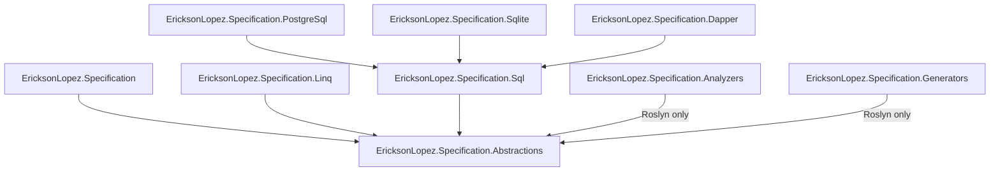
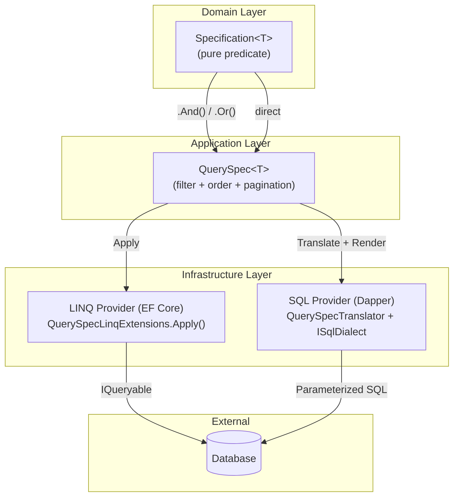
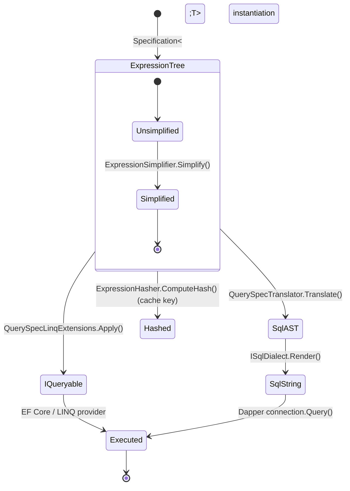

# Architecture — EricksonLopez.Specification

This document describes the architectural design of the `EricksonLopez.Specification` library ecosystem.

> **Core Principle**: A Specification expresses *what* to query. Providers decide *how* to execute it.

---

## 1. Three Non-Negotiable Design Constraints

| Constraint | Consequence |
|---|---|
| **AOT-First** | `ExpressionInterpreter` is the default evaluator. `Expression.Compile()` is opt-in, JIT-only, and annotated `[RequiresDynamicCode]`. |
| **Dapper/SQL-First** | Expression trees translate to parameterized SQL without EF Core. The `Sql` package has zero ORM dependencies. |
| **DDD Correct** | `Specification<T>` is predicate-only (Domain layer). `QuerySpec<T>` carries query concerns (Application layer). They are not the same type. |

---

## 2. Package Dependency Graph

No circular dependencies. Zero upward dependencies.



---

## 3. Layer Mapping (Clean Architecture)



---

## 4. Main Query Execution Flow

```mermaid
sequenceDiagram
    participant App as Application Handler
    participant Spec as QuerySpec&lt;T&gt;
    participant Trans as QuerySpecTranslator
    participant AST as QueryModel
    participant Dialect as ISqlDialect
    participant DB as Database (Dapper)

    App->>Spec: Instantiate (Where, OrderBy, Page)
    App->>Trans: Translate(spec)
    activate Trans
    Trans->>Spec: Read Expressions (Criteria, OrderClauses)
    Trans->>Trans: Transform to SqlPredicateNode AST
    Trans-->>AST: Return QueryModel
    deactivate Trans

    App->>Dialect: Render(queryModel)
    activate Dialect
    Dialect->>Dialect: Traverse AST → safe SQL string
    Dialect-->>App: Return SqlQuery (SQL + Parameters)
    deactivate Dialect

    App->>DB: connection.QueryAsync(sql, parameters)
    DB-->>App: Return entities
```

---

## 5. Expression Lifecycle



---

## 6. Key Components

### Domain Layer

| Component | Type | Responsibility |
|---|---|---|
| `Specification<T>` | Abstract class | Encapsulates a business rule as `Expression<Func<T,bool>>` |
| `Spec` | Static factory | Creates inline specifications (`Spec.For<T>`, `Spec.True<T>`, `Spec.False<T>`) |
| `IExpressionSpecification<T>` | Interface | Exposes expression tree to external consumers |

### Expression Engine

| Component | AOT | Responsibility |
|---|---|---|
| `ExpressionComposer` | ✅ Full | Invoke-free `And/Or/Not` composition |
| `ExpressionSimplifier` | ✅ Full | Constant folding, double-negation elimination |
| `ExpressionHasher` | ✅ Full | Structural hash (ignores parameter names) |
| `ExpressionInterpreter` | ✅ Annotated | AOT-safe in-memory evaluation via tree walk |
| `ExpressionCompilationCache` | ❌ JIT only | Compiled delegate cache `[RequiresDynamicCode]` |
| `ParameterReplacer` | ✅ Full | Parameter rebinding for Invoke-free composition |

### Application Layer

| Component | AOT | Responsibility |
|---|---|---|
| `QuerySpec<T>` | ✅ Full | Immutable sealed record: filter + order + pagination |
| `QuerySpec<T, TResult>` | ✅ Full | Projected query descriptor |
| `QuerySpecExtensions` | ✅ Full | `.And(spec)`, `.Or(spec)` fluent extensions |

### Infrastructure — LINQ

| Component | AOT | Responsibility |
|---|---|---|
| `QuerySpecLinqExtensions` | ✅ Full | `.Apply(spec)` on `IQueryable<T>` |

### Infrastructure — SQL

| Component | AOT | Responsibility |
|---|---|---|
| `QuerySpecTranslator<T>` | ⚠️ Annotated | Translates `QuerySpec<T>` to `QueryModel` AST |
| `QueryModel` | ✅ Full | Provider-agnostic SQL AST |
| `ISqlDialect` | ✅ Full | Pluggable SQL rendering strategy |
| `PostgreSqlDialect` | ✅ Full | PostgreSQL-specific rendering |
| `SqliteDialect` | ✅ Full | SQLite-specific rendering |
| `MsSqlDialect` | ✅ Full | MS SQL Server rendering |
| `IColumnNameResolver` | ✅ Full | Property → column name mapping |

### Infrastructure — Dapper

| Component | AOT | Responsibility |
|---|---|---|
| `QuerySpecDapperExtensions` | ✅ Full | `QueryAsync/QueryFirstOrDefaultAsync/CountAsync` via `IDbConnection` |

### Build-Time

| Component | Target | Responsibility |
|---|---|---|
| `EricksonLopez.Specification.Analyzers` | netstandard2.0 | Roslyn analyzers SPEC001–010 |
| `EricksonLopez.Specification.Generators` | netstandard2.0 | Source generator for `[Spec]` attribute |

---

## 7. AOT / Trimming Policy Summary

| Package | Status |
|---|---|
| Abstractions | ✅ Full AOT — no reflection |
| Core (EricksonLopez.Specification) | ✅ Full AOT (except `ExpressionCompilationCache`) |
| Linq | ✅ Full AOT |
| Sql | ⚠️ Annotated — `[RequiresUnreferencedCode]` on `Translate()` |
| PostgreSql / MsSql / Sqlite | ✅ Full AOT |
| Dapper | ✅ Full with Dapper.AOT |
| Analyzers / Generators | N/A (compile-time only) |

See [docs/aot.md](docs/aot.md) for the complete AOT compatibility table and guidance.

---

## 8. Architecture Decision Records

Significant architectural decisions are documented as ADRs in [docs/adr/](docs/adr/).

Key decisions:
- [adr-001](docs/adr/adr-001-no-write-repository.md): No `IRepository<T>` write contract
- [adr-002](docs/adr/adr-002-no-include-theninclude.md): No `Include/ThenInclude` in core
- [adr-006](docs/adr/adr-006-specification-queryspec-separation.md): Specification/QuerySpec separation
- [adr-009](docs/adr/adr-009-aot-first-design.md): AOT-First design
- [adr-010](docs/adr/adr-010-no-efcore-in-core.md): No EF Core in core package
- [adr-013](docs/adr/adr-013-no-raw-sql.md): No raw SQL / `WhereRaw()`
