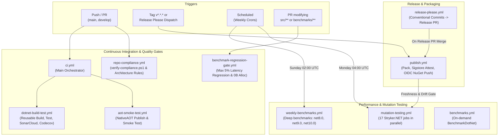

# Build, CI/CD, and Quality Gates

This document describes the GitHub Actions workflows, build process, quality tools, and release strategy for `EricksonLopez.Specification`.

---

## CI/CD Pipeline Overview

The repository maintains 10 GitHub Actions workflows providing automated Continuous Integration, NativeAOT verification, Benchmark regression tracking, Mutation testing quality gates, and automated release publishing:



---

## GitHub Actions Workflows

### 1. `ci.yml` — Continuous Integration Orchestrator

**File**: `.github/workflows/ci.yml`  
**Triggers**:
- Push to `main`, `develop`
- Pull Request targeting `main`, `develop`

**Jobs**:

| Job | Description | Reusable Workflow Called |
|-----|-------------|--------------------------|
| `build-and-test` | Restores, builds Release, runs full test suite with coverage, analyzes via SonarCloud | `.github/workflows/dotnet-build-test.yml` |
| `aot-smoke-test` | Publishes AotSmokeTest with NativeAOT and runs native binary | `.github/workflows/aot-smoke-test.yml` |

**Secrets forwarded**: `SNK_KEY`, `CODECOV_TOKEN`, `SONAR_TOKEN`  
**Artifacts produced**: `test-results`

---

### 2. `dotnet-build-test.yml` — Reusable .NET Build & Test

**File**: `.github/workflows/dotnet-build-test.yml`  
**Type**: Reusable workflow (`workflow_call`)  
**Inputs**:

| Input | Default | Description |
|-------|---------|-------------|
| `dotnet-version` | `10.0.x` | .NET SDK version |
| `test-filter` | `""` | Test filter expression (e.g. `Category!=Integration`) |
| `test-project` | `""` | Specific test project path |
| `upload-coverage` | `true` | Whether to upload coverage to Codecov |
| `artifact-name` | `test-results` | Name of test results artifact |

**Secrets**: `SNK_KEY`, `CODECOV_TOKEN`, `SONAR_TOKEN`  
**Key Steps**:
1. Restore Strong Name key (`SNK_KEY` decoded to `EricksonLopez.Specifications.snk`).
2. Setup Java 17 Zulu and install `dotnet-sonarscanner`.
3. Begin SonarCloud analysis (conditional on `SONAR_TOKEN`).
4. Build solution in `Release` configuration.
5. Run tests with `XPlat Code Coverage` (opencover and cobertura formats).
6. End SonarCloud analysis.
7. Upload `test-results.trx` artifact and Codecov coverage reports.

---

### 3. `aot-smoke-test.yml` — NativeAOT Smoke Test

**File**: `.github/workflows/aot-smoke-test.yml`  
**Triggers**:
- Push / PR to `main`, `develop`
- Reusable call (`workflow_call`)
- Manual dispatch (`workflow_dispatch`)

**Purpose**: Validates genuine NativeAOT compatibility (`PublishAot=true`). Emits compilation warnings as errors (`DOTNET_EnableAotCompilationWarningsAsErrors=true`).  
**Key Steps**:
1. Setup .NET (8.0.x, 9.0.x, 10.0.x).
2. Install NativeAOT build prerequisites (`clang`, `lld`, `zlib1g-dev`).
3. Publish `tests/EricksonLopez.Specification.AotSmokeTest/EricksonLopez.Specification.AotSmokeTest.csproj` with `--runtime linux-x64 --self-contained`.
4. Run `./aot-output/EricksonLopez.Specification.AotSmokeTest` and assert zero exit code.

---

### 4. `benchmark-regression-gate.yml` — PR Performance Regression Gate

**File**: `.github/workflows/benchmark-regression-gate.yml`  
**Triggers**:
- Pull Request targeting `main` or `develop` modifying `src/**` or `benchmarks/**`
- Manual dispatch (`workflow_dispatch`) with configurable `threshold` (default `5`%)

**Enforced Quality Gates**:
1. **Heap Invariant**: Zero-allocation on hot-path combinators (0 B allocated).
2. **Latency Invariant**: Mean latency regression must not exceed 5% against baseline.

**Execution**:
- Runs BenchmarkDotNet in `Release` configuration under `net10.0` (`--job short --filter "*"`).
- Evaluates results using `scripts/verify-benchmark-gate.ps1` comparing against `benchmarks/results/baseline.json`.
- Uploads `pr-benchmark-results-${{ github.run_id }}` artifact.

---

### 5. `benchmarks.yml` — On-Demand Benchmarking

**File**: `.github/workflows/benchmarks.yml`  
**Triggers**: Reusable call (`workflow_call`), manual dispatch (`workflow_dispatch`).  
**Inputs**: `benchmark-filter` (default `*`).  
**Purpose**: Executes BenchmarkDotNet suites, exports JSON and Markdown summaries, syncs artifacts to `benchmarks/results/`, and appends Markdown summaries to `$GITHUB_STEP_SUMMARY`.

---

### 6. `weekly-benchmarks.yml` — Weekly Deep Performance Review

**File**: `.github/workflows/weekly-benchmarks.yml`  
**Triggers**:
- Weekly schedule: Every Sunday at `02:00 UTC` (`cron: '0 2 * * 0'`)
- Manual dispatch (`workflow_dispatch`)

**Behavior**:
- Runs BenchmarkDotNet with the full Default Job (statistically rigorous) across `.NET 8.0`, `.NET 9.0`, and `.NET 10.0`.
- Commits updated baseline files to `benchmarks/results/` with `chore(benchmarks): update weekly performance baseline [skip ci]`.
- Uploads 90-day retained artifact `weekly-benchmark-results-${{ github.run_id }}`.

---

### 7. `mutation-testing.yml` — Stryker Mutation Testing

**File**: `.github/workflows/mutation-testing.yml`  
**Triggers**:
- Weekly schedule: Every Monday at `04:00 UTC` (`cron: '0 4 * * 1'`)
- Reusable call (`workflow_call`) from release orchestration
- Manual dispatch (`workflow_dispatch`) with mutation level selection (`Basic`, `Standard`, `Advanced`)

**Architecture**:
- Runs 17 parallel matrix jobs covering all 17 projects in `src/`:
  - `Core`, `Abstractions`, `Analyzers`, `Dapper`, `DapperExtensions`, `EntityFrameworkCore`, `Generators`, `Linq`, `MariaDb`, `MongoDB`, `MsSql`, `MySql`, `Oracle`, `PostgreSql`, `Sql`, `Sqlite`, `Result`.
- Timeout: 360 minutes (6 hours) per runner.
- Enforced Thresholds (from `stryker-*.json`):
  - High: ≥ 100%
  - Low: ≥ 98%
  - Warn: ≥ 95%
  - Break: < 95% (exits with non-zero code, failing the gate)
- Outputs results to `StrykerOutput/<name>` and uploads individual artifacts.

---

### 8. `publish.yml` — Pack & Publish NuGet

**File**: `.github/workflows/publish.yml`  
**Triggers**:
- Git tag push matching `v*.*.*` (legacy manual release)
- `workflow_dispatch` with optional `version` input (invoked by Release Please)

**Permissions**: `id-token: write`, `contents: write`, `attestations: write`, `statuses: read`, `actions: read`  
**Jobs**:
1. **`evaluate-mutation-gate`**: Evaluates freshness (≤ 7 days) and checks for code drift in `src/` via `scripts/verify-mutation-gate.js`.
2. **`run-mutation-testing`** *(Conditional)*: Invokes `mutation-testing.yml` if results are missing or code has drifted.
3. **`publish`**:
   - Enforces mutation gate threshold (≥ 95%).
   - Restores Strong Name key from `SNK_KEY` secret.
   - Builds in `Release` configuration and runs full test suite with coverage.
   - Packs 16 packages to `./nupkgs/`.
   - Generates Sigstore provenance attestations via `actions/attest-build-provenance@v2`.
   - Authenticates to NuGet.org via OIDC federated login (`NuGet/login@v1`).
   - Pushes packages with `--skip-duplicate`.
   - Generates a GitHub Release on tag-triggered runs.

> **Ecosystem Note**: `EricksonLopez.Specification.Result` is currently excluded from the publish step in `publish.yml` pending upstream synchronization, as documented in `PULL_REQUEST_TEMPLATE.md`.

---

### 9. `release-please.yml` — Automated Release Management

**File**: `.github/workflows/release-please.yml`  
**Triggers**: Push to `main`  
**Action**: `googleapis/release-please-action@v4`  
**Flow**:
1. Evaluates Conventional Commits on `main`.
2. Creates or updates Release PR with release notes and version bump.
3. Upon merge of Release PR, cuts tag `vX.Y.Z`, generates GitHub Release, and dispatches `publish.yml` via GitHub REST API with the new version.

---

### 10. `repo-compliance.yml` — Architecture & Compliance Gate

**File**: `.github/workflows/repo-compliance.yml`  
**Triggers**: Push/PR to `main`, manual dispatch (`workflow_dispatch`)  
**Key Steps**:
1. Executes `scripts/verify-compliance.ps1` checking Clean Architecture layer rules, CPM consistency, and naming conventions.
2. Restores and builds with `TreatWarningsAsErrors=true`.
3. Runs unit tests excluding slow integration tests (`--filter "FullyQualifiedName!~IntegrationTests"`).
4. Validates NuGet packaging with `dotnet pack EricksonLopez.Specifications.slnx --no-build -c Release`.

---

## Build Process

### Configuration

| Property | Value | Source |
|----------|-------|--------|
| Target Frameworks | `net8.0;net10.0` (Libraries)<br>`netstandard2.0` (Analyzers & Generators) | `Directory.Build.props` |
| SDK Version | `10.0.302` | `global.json` |
| Language Version | `preview` | `Directory.Build.props` |
| Nullable | `enable` | `Directory.Build.props` |
| Implicit Usings | `disable` | `Directory.Build.props` |
| Treat Warnings As Errors | `true` (global) | `Directory.Build.props` |
| Analysis Mode | `All` | `Directory.Build.props` |
| Analysis Level | `latest-all` | `Directory.Build.props` |
| Generate Documentation | `true` | `Directory.Build.props` |
| AOT Compatible | `true` (shipping src) | `Directory.Build.props` |
| Enable Trim Analyzer | `true` (shipping src) | `Directory.Build.props` |

### Per-Project Overrides

| Condition | `TreatWarningsAsErrors` | `IsAotCompatible` | Suppressed Warnings |
|-----------|-------------------------|-------------------|---------------------|
| `*.Tests` / `*.IntegrationTests` | `true` | `false` | `CS1591`, `CA1707`, `IDE1006` (Osherove naming) |
| `*.Benchmarks` | `true` | `false` | `CS1591`, `CA1707`, `IDE1006` |
| `*.Analyzers` / `*.Generators` | `true` | `false` | `CS1591`, `RS2008`, `CA1062` |
| `samples/*` | `false` | `true` (AOT demo) | `CA1515` |

### Build Commands

```bash
# Full solution build
dotnet build EricksonLopez.Specifications.slnx

# Build individual package
dotnet build src/EricksonLopez.Specification/EricksonLopez.Specification.csproj

# Build Release configuration (as CI does)
dotnet build EricksonLopez.Specifications.slnx --configuration Release

# Pack packages (Release)
dotnet pack src/EricksonLopez.Specification/EricksonLopez.Specification.csproj -c Release
```

### Strong Name Signing

Assembly signing uses a Strong Name Key (`.snk`) stored exclusively as the `SNK_KEY` GitHub Actions secret (base64-encoded). It is never committed to the repository. The key is decoded ephemerally at build/publish time in both `dotnet-build-test.yml` (for signing during CI) and `publish.yml` (for release packages).

---

## Quality Gates

### Mutation Testing (Stryker.NET)

**Tool**: Stryker.NET (`dotnet-stryker` from `dotnet-tools.json`)

**Configuration**: `stryker-config.json` (default) + per-package configs (`stryker-abstractions-config.json`, etc.)

| Setting | Value |
|---------|-------|
| Solution | `EricksonLopez.Specifications.slnx` |
| Threshold High | 100% |
| Threshold Low | 98% |
| Threshold Break | 95% |
| Coverage Analysis | `perTest` |
| Ignored Mutation Types | `Block`, `Checked` |
| Ignored Methods | `*EnableConcurrentExecution*`, `*ConfigureGeneratedCodeAnalysis*` |

**Mutation gate at publish**: `publish.yml` runs `scripts/verify-mutation-gate.js` before packing. If any package is below 95%, the publish job is aborted.

**Commands**:

```bash
dotnet tool restore                      # Install stryker from dotnet-tools.json
dotnet stryker                           # Full solution (default config)
dotnet stryker --project EricksonLopez.Specification.csproj  # Specific project
```

**Reporters**: HTML, JSON, Cleartext, Progress

### Code Coverage (Coverlet)

Coverlet collects coverage during `dotnet test` via the `XPlat Code Coverage` data collector.

| Aspect | Detail |
|--------|--------|
| Format | `opencover` and `cobertura` |
| Report destination | `./test-results/` |
| Codecov integration | ✅ Active — `codecov/codecov-action@v4` in `dotnet-build-test.yml` |
| Codecov token | `CODECOV_TOKEN` secret |
| Upload flags | `unittests` (CI), `publish-gate` (publish workflow) |

**Local collection**:

```bash
dotnet test EricksonLopez.Specifications.slnx --collect:"XPlat Code Coverage" --results-directory ./coverage
```

### Static Analysis (SonarCloud + Roslyn)

- **SonarCloud**: `SONAR_TOKEN` secret. Analysis via `dotnet sonarscanner` in `dotnet-build-test.yml`. Organization: `ericksonlopezf`. Conditional — only runs when `SONAR_TOKEN` is present.
- **Roslyn**: `AnalysisMode=All` and `AnalysisLevel=latest-all` activate all available .NET analyzers globally.
- **Custom Analyzers**: `EricksonLopez.Specification.Analyzers` provides diagnostics `SPEC001`–`SPEC011` (`DevelopmentDependency=true`).

### Dependency Scanning (Dependabot)

**File**: `.github/dependabot.yml`

| Ecosystem | Directory | Schedule | Groups |
|-----------|-----------|----------|--------|
| `nuget` | `/` | Weekly (Monday) | `roslyn`, `testing`, `benchmarks` |
| `github-actions` | `/` | Weekly (Monday) | — |

---

## Branch Strategy

Based on CI trigger configuration (`ci.yml`):

| Branch | CI Trigger | Purpose |
|--------|------------|---------|
| `main` | Push + PR | Production-ready code; releases are cut from here via Release Please |
| `develop` | Push + PR | Integration branch for feature work |

Short-lived branches (`feature/*`, `bugfix/*`, `docs/*`) are merged to `develop` first, then `develop` is promoted to `main` for release.

---

## Release Strategy

| Aspect | State |
|--------|-------|
| Versioning | `VersionPrefix=2.0.0` in `Directory.Build.props` |
| Versioning tool | [Release Please](https://github.com/googleapis/release-please) — reads Conventional Commits |
| Git tags | `v2.0.0` (Official Release — 2026-09-21) |
| NuGet packages | 16 packages configured for publishing via OIDC Trusted Publishing |
| Pre-release detection | `contains(version, '-')` → `prerelease: true` in GitHub Release |
| Skip-duplicate | `--skip-duplicate` on `dotnet nuget push` |

**Automated release flow**:


---

## Supply Chain Security

| Mechanism | Status | Source |
|-----------|--------|--------|
| Strong Name Signing | ✅ Configured | `publish.yml` — `SNK_KEY` secret, decoded ephemerally |
| NuGet Trusted Publishing (OIDC) | ✅ Configured | `publish.yml` — `NuGet/login@v1`, no static API key |
| Sigstore Provenance Attestation | ✅ Configured | `publish.yml` — `actions/attest-build-provenance@v2` on all `.nupkg` |
| Mutation Quality Gate at Publish | ✅ Configured | `publish.yml` — `scripts/verify-mutation-gate.js`, break ≥ 95% |
| Central Package Management | ✅ Active | `Directory.Packages.props` — all dependencies version-pinned |
| Dependabot | ✅ Active | `.github/dependabot.yml` — weekly NuGet + GitHub Actions |
| SonarCloud SAST | ✅ Configured | `dotnet-build-test.yml` — conditional on `SONAR_TOKEN` |
| Codecov Coverage Gate | ✅ Active | CI + publish gate both upload coverage |

---

## AOT Publish Gate

The `aot-smoke-test` job in `ci.yml` invokes `.github/workflows/aot-smoke-test.yml`, compiling and executing `tests/EricksonLopez.Specification.AotSmokeTest` as a genuine NativeAOT binary. This is a hard gate that prevents merging if the core library introduces trimming or reflection warnings:

```bash
dotnet publish tests/EricksonLopez.Specification.AotSmokeTest/EricksonLopez.Specification.AotSmokeTest.csproj \
  --configuration Release \
  --runtime linux-x64 \
  --self-contained \
  -p:TreatWarningsAsErrors=true \
  -p:WarningLevel=5 \
  --output ./aot-output

# Run native binary and assert zero exit code:
./aot-output/EricksonLopez.Specification.AotSmokeTest
# Expected: Zero IL2026/IL3050 warnings and clean exit
```

This validates the AOT compatibility claim on every push and PR.
