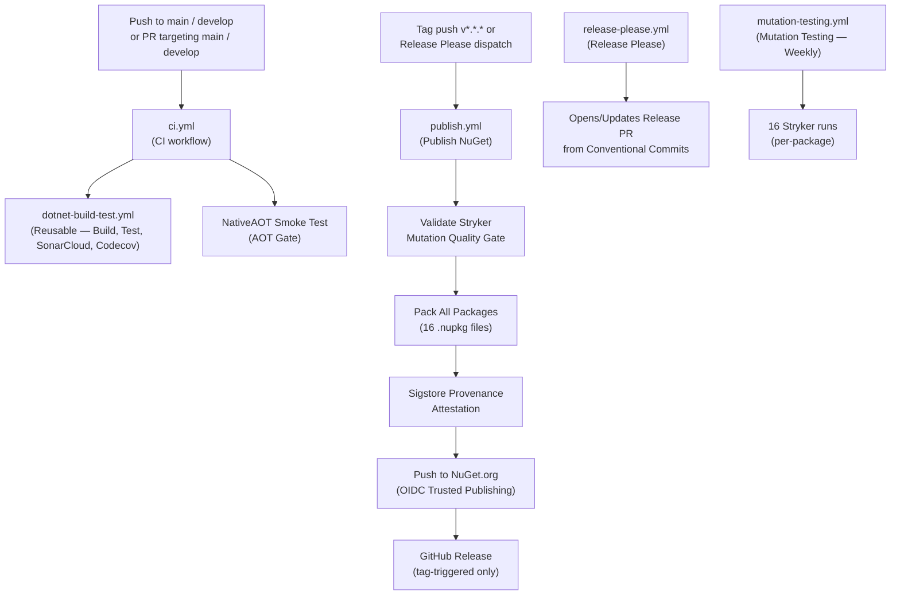
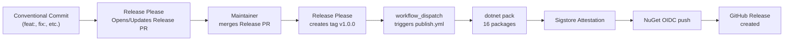

# Build, CI/CD, and Quality Gates

This document describes the GitHub Actions workflows, build process, quality tools, and release strategy for `EricksonLopez.Specification`.

---

## CI/CD Pipeline Overview



---

## GitHub Actions Workflows

### `ci.yml` — Continuous Integration (Build, Test, AOT Gate)

**File**: `.github/workflows/ci.yml`

**Triggers**:
- Push to `main`, `develop`
- Pull Request targeting `main`, `develop`

**Jobs**:

| Job | Description |
|-----|-------------|
| `build-and-test` | Calls `dotnet-build-test.yml` (reusable); runs build + tests + SonarCloud + Codecov |
| `aot-gate` | Compiles and runs `samples/NativeAotDapper` as a NativeAOT binary — fails if ILLink warnings appear |

**Secrets required**:

| Secret | Used in | Purpose |
|--------|---------|---------|
| `SNK_KEY` | `build-and-test` (via reusable) | Base64-encoded Strong Name key for assembly signing |
| `CODECOV_TOKEN` | `build-and-test` (via reusable) | Codecov upload token |
| `SONAR_TOKEN` | `build-and-test` (via reusable) | SonarCloud analysis token |

**Artifacts produced**: `test-results` (uploaded by reusable workflow)

---

### `dotnet-build-test.yml` — Reusable Build & Test

**File**: `.github/workflows/dotnet-build-test.yml`

**Type**: Reusable workflow (`workflow_call`)

**Inputs**:

| Input | Default | Description |
|-------|---------|-------------|
| `dotnet-version` | `10.0.x` | .NET SDK version |
| `test-filter` | `""` | Test filter expression |
| `test-project` | `""` | Specific test project path |
| `upload-coverage` | `true` | Upload coverage to Codecov |
| `artifact-name` | `test-results` | Name of artifact |

**Secrets**: `SNK_KEY`, `CODECOV_TOKEN`, `SONAR_TOKEN`

**Steps**:

| Step | Action | Notes |
|------|--------|-------|
| Checkout | `actions/checkout@v4` | `fetch-depth: 0` for full history |
| Setup .NET | `actions/setup-dotnet@v4` | `10.0.x` |
| Restore SNK | inline script | Decodes `SNK_KEY` if present |
| Setup Java | `actions/setup-java@v3` | Java 17 (Zulu) for SonarScanner |
| Install SonarScanner | `dotnet tool install` | `dotnet-sonarscanner` global tool |
| Begin Sonar Analysis | `dotnet sonarscanner begin` | Conditional on `SONAR_TOKEN` present |
| Build | `dotnet build` | `Release` configuration |
| Run tests | `dotnet test` | All test projects, XPlat Code Coverage (opencover + cobertura) |
| End Sonar Analysis | `dotnet sonarscanner end` | Conditional on `SONAR_TOKEN` present |
| Upload test results | `actions/upload-artifact@v4` | Always runs |
| Upload coverage | `codecov/codecov-action@v4` | Conditional on `upload-coverage` input |

---

### `publish.yml` — Pack & Publish NuGet

**File**: `.github/workflows/publish.yml`

**Triggers**:
- Push of tag matching `v*.*.*` (legacy manual tag)
- `workflow_dispatch` (manual or triggered by `release-please.yml`)

**Required permissions**: `id-token: write`, `contents: write`, `attestations: write`, `statuses: read`, `actions: read`

**Secrets required**:

| Secret | Purpose |
|--------|---------|
| `SNK_KEY` | Base64-encoded Strong Name key for assembly signing |
| `CODECOV_TOKEN` | Codecov upload during publish gate |

> **OIDC Note**: NuGet push uses `NuGet/login@v1` (OIDC federated identity). No static NuGet API key secret is required or stored.

**Steps**:

| Step | Description |
|------|-------------|
| Checkout | `fetch-depth: 0` |
| Resolve version | From `workflow_dispatch` input → git tag → `Directory.Build.props` fallback |
| Validate Stryker Quality Gate | Calls `scripts/verify-mutation-gate.js` — aborts publish if any package is below 95% mutation score |
| Setup .NET | `10.0.x` |
| Restore Strong Name key | Decodes `SNK_KEY` to `EricksonLopez.Specification.snk` ephemerally |
| Restore | `dotnet restore EricksonLopez.Specifications.slnx` |
| Build (Release) | `dotnet build --configuration Release` |
| Run tests | Full test suite with code coverage before packing |
| Upload coverage to Codecov | `codecov/codecov-action@v5`, flag `publish-gate` |
| Pack All Packages | Packs 16 packable projects to `./nupkgs/` with version override |
| Generate Sigstore Provenance | `actions/attest-build-provenance@v2` — all `.nupkg` files |
| NuGet login (OIDC) | `NuGet/login@v1` — returns ephemeral API key |
| Push to NuGet.org | `dotnet nuget push --skip-duplicate` |
| Create GitHub Release | `softprops/action-gh-release@v2` — only on tag-triggered runs; includes `prerelease: true` if version contains `-` |

**Packages published** (16 packages):

`Abstractions`, `Specification` (Core), `Analyzers`, `Dapper`, `DapperExtensions`, `EntityFrameworkCore`, `Generators`, `Linq`, `MariaDb`, `MongoDB`, `MsSql`, `MySql`, `Oracle`, `PostgreSql`, `Sql`, `Sqlite`

> **Note**: `EricksonLopez.Specification.Result` is **not** included in the publish step of this workflow.

**Artifacts produced**: `./nupkgs/*.nupkg` (16 files), GitHub Release (tag-triggered only)

---

### `release-please.yml` — Automated Release Management

**File**: `.github/workflows/release-please.yml`

**Trigger**: Push to `main`

**Tool**: [Release Please](https://github.com/googleapis/release-please)

**Behavior**:
1. Scans commit messages for [Conventional Commits](https://www.conventionalcommits.org/) prefixes (`feat:`, `fix:`, `docs:`, etc.)
2. Opens or updates a Release PR with a generated CHANGELOG and version bump
3. When the Release PR is merged, creates a GitHub Release and tag `vX.Y.Z`
4. Dispatches `publish.yml` via `workflow_dispatch` with the new version

**Configuration**: `.release-please-config.json`, `.release-please-manifest.json`

---

### `mutation-testing.yml` — Mutation Testing

**File**: `.github/workflows/mutation-testing.yml`

**Triggers**: Manual (`workflow_dispatch`), scheduled (weekly)

**Description**: Runs Stryker.NET mutation testing for all 16 packages in parallel (per-package configs: `stryker-config.json`, `stryker-abstractions-config.json`, etc.). Results are uploaded as GitHub Actions artifacts.

---

## Build Process

### Configuration

| Property | Value | Source |
|----------|-------|--------|
| Target Framework | `net10.0` | `Directory.Build.props` |
| SDK Version | `10.0.302` | `global.json` |
| Language Version | `preview` | `Directory.Build.props` |
| Nullable | `enable` | `Directory.Build.props` |
| Implicit Usings | `disable` | `Directory.Build.props` |
| Treat Warnings As Errors | `true` (global) | `Directory.Build.props` |
| Analysis Mode | `All` | `Directory.Build.props` |
| Analysis Level | `latest-all` | `Directory.Build.props` |
| Generate Documentation | `true` | `Directory.Build.props` |
| AOT Compatible | `true` (shipping src) | `Directory.Build.props` |
| Enable Trim Analyzer | `true` (shipping src) | `Directory.Build.props` |

### Per-Project Overrides

| Condition | `TreatWarningsAsErrors` | `IsAotCompatible` | Suppressed Warnings |
|-----------|-------------------------|-------------------|---------------------|
| `*.Tests` / `*.IntegrationTests` | `true` | `false` | `CS1591`, `CA1707`, `IDE1006` (Osherove naming) |
| `*.Benchmarks` | `true` | `false` | `CS1591`, `CA1707`, `IDE1006` |
| `*.Analyzers` / `*.Generators` | `true` | `false` | `CS1591`, `RS2008`, `CA1062` |
| `samples/*` | `false` | `true` (AOT demo) | `CA1515` |

### Build Commands

```bash
# Full solution build
dotnet build EricksonLopez.Specifications.slnx

# Build individual package
dotnet build src/EricksonLopez.Specification/EricksonLopez.Specification.csproj

# Build Release configuration (as CI does)
dotnet build EricksonLopez.Specifications.slnx --configuration Release

# Pack packages (Release)
dotnet pack src/EricksonLopez.Specification/EricksonLopez.Specification.csproj -c Release
```

### Strong Name Signing

Assembly signing uses a Strong Name Key (`.snk`) stored exclusively as the `SNK_KEY` GitHub Actions secret (base64-encoded). It is never committed to the repository. The key is decoded ephemerally at build/publish time in both `dotnet-build-test.yml` (for signing during CI) and `publish.yml` (for release packages).

---

## Quality Gates

### Mutation Testing (Stryker.NET)

**Tool**: Stryker.NET (`dotnet-stryker` from `dotnet-tools.json`)

**Configuration**: `stryker-config.json` (default) + per-package configs (`stryker-abstractions-config.json`, etc.)

| Setting | Value |
|---------|-------|
| Solution | `EricksonLopez.Specifications.slnx` |
| Threshold High | 100% |
| Threshold Low | 98% |
| Threshold Break | 95% |
| Coverage Analysis | `perTest` |
| Ignored Mutation Types | `Block`, `Checked` |
| Ignored Methods | `*EnableConcurrentExecution*`, `*ConfigureGeneratedCodeAnalysis*` |

**Mutation gate at publish**: `publish.yml` runs `scripts/verify-mutation-gate.js` before packing. If any package is below 95%, the publish job is aborted.

**Commands**:

```bash
dotnet tool restore                      # Install stryker from dotnet-tools.json
dotnet stryker                           # Full solution (default config)
dotnet stryker --project EricksonLopez.Specification.csproj  # Specific project
```

**Reporters**: HTML, JSON, Cleartext, Progress

### Code Coverage (Coverlet)

Coverlet collects coverage during `dotnet test` via the `XPlat Code Coverage` data collector.

| Aspect | Detail |
|--------|--------|
| Format | `opencover` and `cobertura` |
| Report destination | `./test-results/` |
| Codecov integration | ✅ Active — `codecov/codecov-action@v4` in `dotnet-build-test.yml` |
| Codecov token | `CODECOV_TOKEN` secret |
| Upload flags | `unittests` (CI), `publish-gate` (publish workflow) |

**Local collection**:

```bash
dotnet test EricksonLopez.Specifications.slnx --collect:"XPlat Code Coverage" --results-directory ./coverage
```

### Static Analysis (SonarCloud + Roslyn)

- **SonarCloud**: `SONAR_TOKEN` secret. Analysis via `dotnet sonarscanner` in `dotnet-build-test.yml`. Organization: `ericksonlopezf`. Conditional — only runs when `SONAR_TOKEN` is present.
- **Roslyn**: `AnalysisMode=All` and `AnalysisLevel=latest-all` activate all available .NET analyzers globally.
- **Custom Analyzers**: `EricksonLopez.Specification.Analyzers` provides diagnostics `SPEC001`–`SPEC011` (`DevelopmentDependency=true`).

### Dependency Scanning (Dependabot)

**File**: `.github/dependabot.yml`

| Ecosystem | Directory | Schedule | Groups |
|-----------|-----------|----------|--------|
| `nuget` | `/` | Weekly (Monday) | `roslyn`, `testing`, `benchmarks` |
| `github-actions` | `/` | Weekly (Monday) | — |

---

## Branch Strategy

Based on CI trigger configuration (`ci.yml`):

| Branch | CI Trigger | Purpose |
|--------|------------|---------|
| `main` | Push + PR | Production-ready code; releases are cut from here via Release Please |
| `develop` | Push + PR | Integration branch for feature work |

Short-lived branches (`feature/*`, `bugfix/*`, `docs/*`) are merged to `develop` first, then `develop` is promoted to `main` for release.

---

## Release Strategy

| Aspect | State |
|--------|-------|
| Versioning | `VersionPrefix=1.0.0` in `Directory.Build.props` |
| Versioning tool | [Release Please](https://github.com/googleapis/release-please) — reads Conventional Commits |
| Git tags | None published yet |
| NuGet packages | Not published yet |
| Pre-release detection | `contains(version, '-')` → `prerelease: true` in GitHub Release |
| Skip-duplicate | `--skip-duplicate` on `dotnet nuget push` |

**Automated release flow**:



---

## Supply Chain Security

| Mechanism | Status | Source |
|-----------|--------|--------|
| Strong Name Signing | ✅ Configured | `publish.yml` — `SNK_KEY` secret, decoded ephemerally |
| NuGet Trusted Publishing (OIDC) | ✅ Configured | `publish.yml` — `NuGet/login@v1`, no static API key |
| Sigstore Provenance Attestation | ✅ Configured | `publish.yml` — `actions/attest-build-provenance@v2` on all `.nupkg` |
| Mutation Quality Gate at Publish | ✅ Configured | `publish.yml` — `scripts/verify-mutation-gate.js`, break ≥ 95% |
| Central Package Management | ✅ Active | `Directory.Packages.props` — all dependencies version-pinned |
| Dependabot | ✅ Active | `.github/dependabot.yml` — weekly NuGet + GitHub Actions |
| SonarCloud SAST | ✅ Configured | `dotnet-build-test.yml` — conditional on `SONAR_TOKEN` |
| Codecov Coverage Gate | ✅ Active | CI + publish gate both upload coverage |

---

## AOT Publish Gate

The final job of `ci.yml` (`aot-gate`) compiles and runs `samples/NativeAotDapper` as a NativeAOT binary. This is a hard gate that prevents merging if the core library introduces ILLink warnings:

```bash
dotnet publish samples/NativeAotDapper/NativeAotDapper.csproj -c Release -p:PublishAot=true --no-restore
# Expected: Zero ILLink warnings from EricksonLopez.Specification.*
```

This validates the AOT compatibility claim on every push and PR.
