# NuGet Packages & Ecosystem

The `EricksonLopez.Specification` ecosystem is organized into modular packages adhering to Clean Architecture principles. Consumers only install what is needed for their target architectural layer and storage providers.

> **Core Principle**: Zero ORM dependency in domain core. Infrastructure complexity and storage dialects are opt-in extension packages.

---

## Central Package Management (CPM)

All external dependencies are centrally versioned in [`Directory.Packages.props`](../Directory.Packages.props).

| Dependency | Pinned Version | Scope |
|---|---|---|
| `Dapper` | 2.1.79 | Micro-ORM SQL execution |
| `Dapper.AOT` | 1.0.52 | Native AOT code generation for Dapper |
| `Npgsql` | 10.0.3 | PostgreSQL provider driver |
| `Microsoft.EntityFrameworkCore` | 9.0.2 | EF Core LINQ and relational engine |
| `Microsoft.EntityFrameworkCore.Relational` | 9.0.2 | EF Core relational extensions |
| `Microsoft.EntityFrameworkCore.InMemory` | 9.0.2 | In-memory testing provider |
| `Microsoft.EntityFrameworkCore.Sqlite` | 9.0.2 | SQLite EF Core provider |
| `MongoDB.Driver` | 3.11.1 | MongoDB document store driver |
| `Microsoft.Extensions.Hosting` | 10.0.11 | Generic host & runtime integration |
| `Microsoft.Extensions.DependencyInjection.Abstractions` | 10.0.2 | Dependency Injection abstractions |
| `Microsoft.CodeAnalysis.CSharp` | 5.9.0 | Roslyn compiler API for analyzers & generators |
| `OpenTelemetry.Api` | 1.10.0 | Distributed tracing and metrics |
| `System.Diagnostics.DiagnosticSource` | 9.0.0 | Observability ActivitySource & Meter |
| `EricksonLopez.Result` | 1.0.0 | Functional Result pattern integration |

---

## Dependency Graph

```mermaid
graph TD
    ABS[EricksonLopez.Specification.Abstractions]
    CORE[EricksonLopez.Specification]
    LINQ[EricksonLopez.Specification.Linq]
    SQL[EricksonLopez.Specification.Sql]
    
    PG[EricksonLopez.Specification.PostgreSql]
    MSSQL[EricksonLopez.Specification.MsSql]
    MYSQL[EricksonLopez.Specification.MySql]
    MARIADB[EricksonLopez.Specification.MariaDb]
    SQLITE[EricksonLopez.Specification.Sqlite]
    ORACLE[EricksonLopez.Specification.Oracle]
    
    DAPPER[EricksonLopez.Specification.Dapper]
    EFCORE[EricksonLopez.Specification.EntityFrameworkCore]
    MONGO[EricksonLopez.Specification.MongoDB]
    DAPPEREXT[EricksonLopez.Specification.DapperExtensions]
    RESULT[EricksonLopez.Specification.Result]
    
    ANA[EricksonLopez.Specification.Analyzers]
    GEN[EricksonLopez.Specification.Generators]

    CORE --> ABS
    LINQ --> ABS
    SQL --> CORE
    
    PG --> SQL
    MSSQL --> SQL
    MYSQL --> SQL
    MARIADB --> SQL
    SQLITE --> SQL
    ORACLE --> SQL
    
    DAPPER --> SQL
    EFCORE --> ABS
    EFCORE --> LINQ
    MONGO --> ABS
    MONGO --> LINQ
    DAPPEREXT --> CORE
    DAPPEREXT --> SQL
    RESULT --> ABS
    
    ANA -.->|Build-time| ABS
    GEN -.->|Build-time| ABS
```

---

## Package Catalog

Shipping library packages multi-target `.NET 8`, `.NET 9`, and `.NET 10` (`TargetFrameworks=net8.0;net9.0;net10.0` with `LangVersion=preview`). Tooling packages (`Analyzers` and `Generators`) target `.NET Standard 2.0` (`netstandard2.0`) for broad Roslyn IDE and build host compatibility.

### 1. `EricksonLopez.Specification.Abstractions`
- **Purpose**: Foundational contracts with zero external dependencies.
- **Public Surface**: `ISpecification<T>`, `IExpressionSpecification<T>`, `QuerySpec<T>`, `QuerySpec<T, TResult>`, `IReadRepository<T>`, `OrderClause<T>`, `OrderDirection`, `CursorClause<T>`, `CursorDirection`.
- **AOT Compatibility**: ✅ 100% Native AOT compatible.

### 2. `EricksonLopez.Specification` (Core)
- **Purpose**: Core specification engine, AST expression composition, in-memory interpretation, and diagnostic formatting.
- **Public Surface**: `Specification<T>`, `Spec` static factories/combinators (`Spec.All`, `Spec.Any`, `Spec.Between`, `Spec.FullText`, `Spec.InRange`), `ExpressionComposer`, `ExpressionSimplifier`, `ExpressionHasher`, `ExpressionInterpreter`, `ExpressionCompilationCache`.
- **AOT Compatibility**: ✅ 100% Native AOT compatible via `ExpressionInterpreter` (JIT caching is annotated `[RequiresDynamicCode]`).

### 3. `EricksonLopez.Specification.Linq`
- **Purpose**: Adapter applying `QuerySpec<T>` onto standard `IQueryable<T>` data sources.
- **Public Surface**: `QuerySpecLinqExtensions.Apply()` (two overloads: `QuerySpec<T>` and `QuerySpec<T, TResult>`), `Any(IExpressionSpecification<T>)`, `Count(IExpressionSpecification<T>)`.
- **AOT Compatibility**: ✅ 100% Native AOT compatible.

### 4. `EricksonLopez.Specification.Sql`
- **Purpose**: Provider-agnostic SQL AST generation and LRU bounded query plan caching.
- **Public Surface**: `QuerySpecTranslator<T>`, `QueryModel`, `ISqlDialect`, `SqlQuery`, `IColumnNameResolver`, `SnakeCaseColumnNameResolver`, `VerbatimColumnNameResolver`, `QueryPlanCache`.
- **AOT Compatibility**: ⚠️ Annotated (`[RequiresUnreferencedCode]` on closure extraction).

### 5. `EricksonLopez.Specification.PostgreSql`
- **Purpose**: PostgreSQL native dialect.
- **Features**: `ILIKE` case-insensitive matching, `$n` positional parameters, `LIMIT/OFFSET`, PostgreSQL full-text search (`to_tsvector @@ plainto_tsquery`), range inclusion (`<@ int4range`).
- **AOT Compatibility**: ✅ 100% Native AOT compatible.

### 6. `EricksonLopez.Specification.MsSql`
- **Purpose**: Microsoft SQL Server (T-SQL) native dialect.
- **Features**: Bracket quoting (`[column]`), `@parameters`, `OFFSET n ROWS FETCH NEXT m ROWS ONLY`, `TOP (n)` limits, `LIKE` escaping.
- **AOT Compatibility**: ✅ 100% Native AOT compatible.

### 7. `EricksonLopez.Specification.MySql`
- **Purpose**: MySQL native dialect.
- **Features**: Backtick quoting (` `column` `), `@parameters`, `LIMIT offset, limit`, expanded IN clauses.
- **AOT Compatibility**: ✅ 100% Native AOT compatible.

### 8. `EricksonLopez.Specification.MariaDb`
- **Purpose**: MariaDB native dialect.
- **Features**: Backtick quoting, `@parameters`, `LIMIT/OFFSET`, optimized string literals.
- **AOT Compatibility**: ✅ 100% Native AOT compatible.

### 9. `EricksonLopez.Specification.Sqlite`
- **Purpose**: SQLite native dialect.
- **Features**: Standard identifier escaping, `@parameters`, `LIMIT n OFFSET m`.
- **AOT Compatibility**: ✅ 100% Native AOT compatible.

### 10. `EricksonLopez.Specification.Oracle`
- **Purpose**: Oracle Database dialect.
- **Features**: Double-quote identifier quoting (`"COLUMN"`), `:p` named parameters, `OFFSET n ROWS FETCH NEXT m ROWS ONLY`.
- **AOT Compatibility**: ✅ 100% Native AOT compatible.

### 11. `EricksonLopez.Specification.Dapper`
- **Purpose**: High-performance Dapper execution extensions over `IDbConnection`.
- **Public Surface**: `QueryAsync<T>`, `QueryFirstOrDefaultAsync<T>`, `ExecuteScalarAsync<T>`, `CountAsync`, `AnyAsync`.
- **AOT Compatibility**: ✅ 100% Native AOT compatible (paired with Dapper.AOT).

### 12. `EricksonLopez.Specification.EntityFrameworkCore`
- **Purpose**: Asynchronous `IReadRepository<T>` implementation for Entity Framework Core DbContexts.
- **Public Surface**: `SpecificationEvaluator`, `EfRepository<T>`, `EfReadRepository<T>`.
- **AOT Compatibility**: ✅ Full compatibility.

### 13. `EricksonLopez.Specification.MongoDB`
- **Purpose**: MongoDB driver filter and sort descriptor compiler.
- **Public Surface**: `MongoFilterCompiler`, `MongoSortCompiler`, `MongoSpecificationExtensions`.
- **AOT Compatibility**: ✅ Full compatibility.

### 14. `EricksonLopez.Specification.DapperExtensions`
- **Purpose**: Adapter executing specifications over the external `EricksonLopez.DapperExtensions` library (Unit-of-Work and repository sessions). Requires `EricksonLopez.DapperExtensions` to be available at runtime.
- **AOT Compatibility**: ✅ Full compatibility.
- **Publish status**: ✅ Included in `publish.yml`.

### 15. `EricksonLopez.Specification.Result`
- **Purpose**: Functional `Result<T>` query extensions over `IReadRepository<T>`.
- **AOT Compatibility**: ✅ Full compatibility.
- **Publish status**: ⚠️ **Not included in `publish.yml`** — listed in the solution but not in the current publish step. See `.github/workflows/publish.yml`.

### 16. `EricksonLopez.Specification.Analyzers`
- **Purpose**: Compile-time Roslyn diagnostic analyzers and CodeFix providers (`SPEC001`–`SPEC011`).
- **AOT Compatibility**: ✅ N/A (Build-time only).

### 17. `EricksonLopez.Specification.Generators`
- **Purpose**: Experimental Roslyn incremental source generator for compile-time column resolution and static ordering (v2.0 preview).
- **AOT Compatibility**: ✅ N/A (Build-time only).
- **Publish status**: ✅ Included in `publish.yml` (despite adr-020 and TASK-R007 originally planning to exclude it; included in publish.yml as of current state).

---

## Compatibility Matrix

| Package | .NET 8 / 10 | Native AOT | Entity Framework Core | Dapper | MongoDB |
|---|:---:|:---:|:---:|:---:|:---:|
| `Abstractions` | ✅ Yes | ✅ Full | ✅ Yes | ✅ Yes | ✅ Yes |
| `Specification` (Core) | ✅ Yes | ✅ Full (Interpreted) | ✅ Yes | ✅ Yes | ✅ Yes |
| `Linq` | ✅ Yes | ✅ Full | ✅ Yes | ❌ N/A | ❌ N/A |
| `Sql` | ✅ Yes | ⚠️ Annotated | ❌ N/A | ✅ Yes | ❌ N/A |
| `PostgreSql` | ✅ Yes | ✅ Full | ❌ N/A | ✅ Yes | ❌ N/A |
| `MsSql` | ✅ Yes | ✅ Full | ❌ N/A | ✅ Yes | ❌ N/A |
| `MySql` | ✅ Yes | ✅ Full | ❌ N/A | ✅ Yes | ❌ N/A |
| `MariaDb` | ✅ Yes | ✅ Full | ❌ N/A | ✅ Yes | ❌ N/A |
| `Sqlite` | ✅ Yes | ✅ Full | ❌ N/A | ✅ Yes | ❌ N/A |
| `Oracle` | ✅ Yes | ✅ Full | ❌ N/A | ✅ Yes | ❌ N/A |
| `Dapper` | ✅ Yes | ✅ Full (Dapper.AOT) | ❌ N/A | ✅ Yes | ❌ N/A |
| `EntityFrameworkCore` | ✅ Yes | ✅ Full | ✅ Yes | ❌ N/A | ❌ N/A |
| `MongoDB` | ✅ Yes | ✅ Full | ❌ N/A | ❌ N/A | ✅ Yes |
| `DapperExtensions` | ✅ Yes | ✅ Full | ❌ N/A | ✅ Yes | ❌ N/A |
| `Result` | ✅ Yes | ✅ Full | ✅ Yes | ✅ Yes | ✅ Yes |
| `Analyzers` | ✅ Roslyn 5.9 | N/A (Dev) | N/A | N/A | N/A |
| `Generators` | ✅ Roslyn 5.9 | N/A (Dev) | N/A | N/A | N/A |
