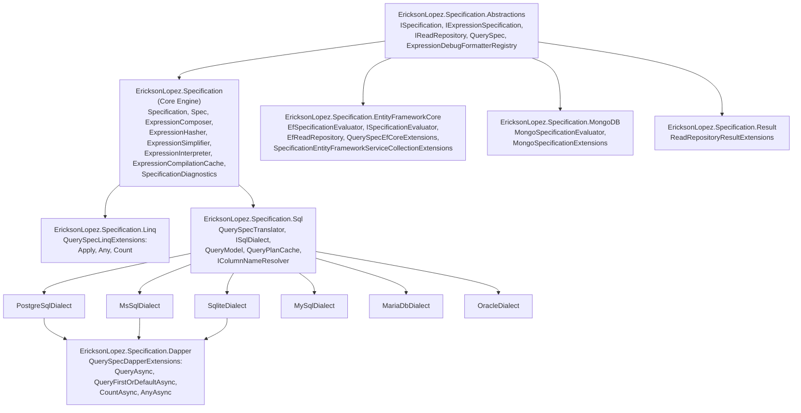
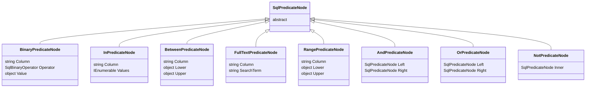
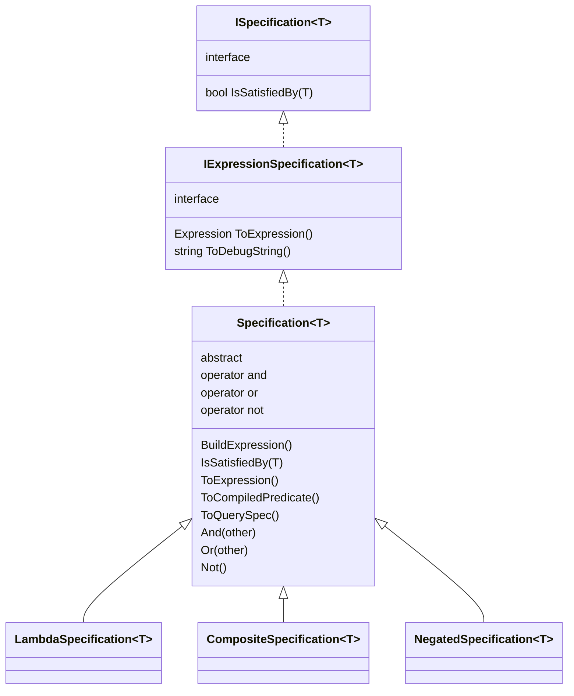
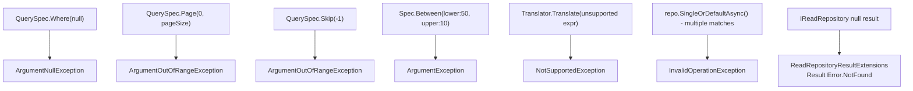
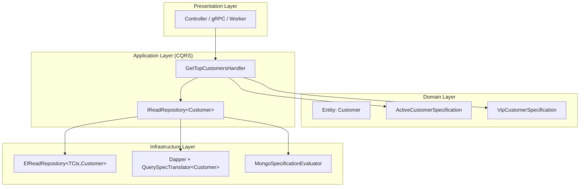
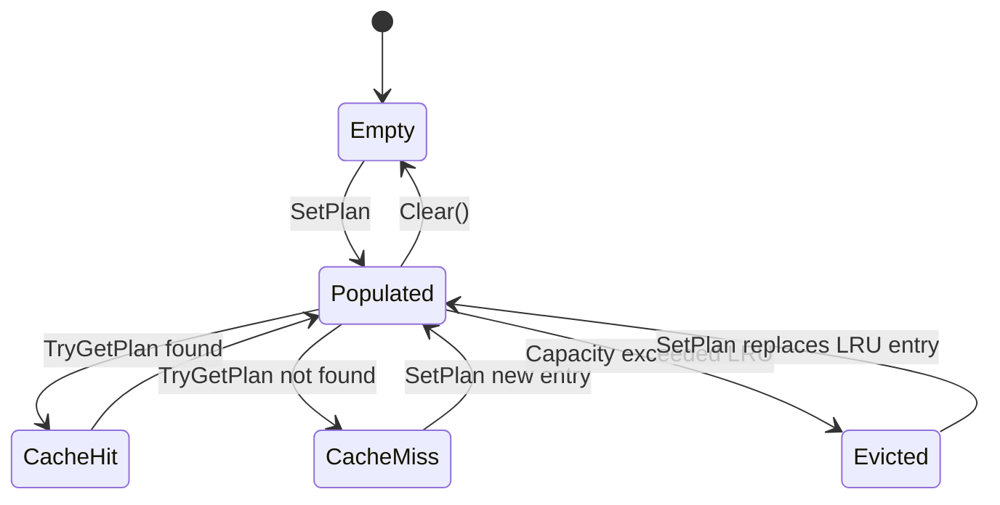
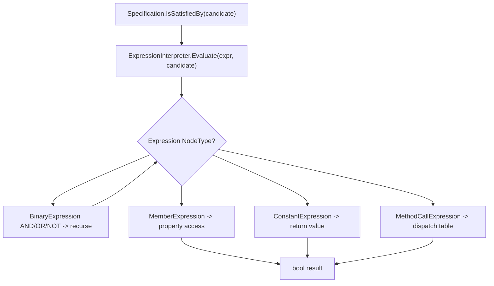

# Architecture Diagrams — EricksonLopez.Specification
<!-- Phase 7: Diagrams based exclusively on the discovered public API -->

---

## 1. General Package Architecture



---

## 2. Main Workflow: Definition → Evaluation

```mermaid
sequenceDiagram
    participant Domain as Domain Layer
    participant Spec as Specification&lt;T&gt;
    participant Engine as Expression Engine
    participant Repo as IReadRepository&lt;T&gt;
    participant Infra as Infrastructure

    Domain->>Spec: new ActiveCustomerSpecification()
    Note over Spec: Diagnostics.SpecificationsCreated++
    Spec->>Engine: BuildExpression() lazy cached
    Domain->>Spec: IsSatisfiedBy(customer)
    Spec->>Engine: ExpressionInterpreter.Evaluate(expr, candidate)
    Note over Engine: AOT-safe, no IL emit
    Engine-->>Domain: bool

    Domain->>Repo: ListAsync(QuerySpec&lt;T&gt;)
    Repo->>Infra: EF Core / Dapper / MongoDB
    Infra-->>Domain: IReadOnlyList&lt;T&gt;
```

---

## 3. QuerySpec Construction Pipeline

```mermaid
flowchart LR
    A["QuerySpec&lt;T&gt;.Empty"]
    B[".Where(predicate)"]
    C[".And(Specification&lt;T&gt;)"]
    D[".OrderBy / .OrderByDescending"]
    E[".ThenBy / .ThenByDescending"]
    F[".Page(page, pageSize)"]
    G[".Take(n) / .Skip(n)"]
    H[".Distinct()"]
    I[".TagWith(tag)"]
    J[".WithCursor / .SeekAfter / .SeekBefore"]
    K[".Select() -> QuerySpec&lt;T,TResult&gt;"]

    A --> B --> C --> D --> E --> F --> G --> H --> I --> J --> K
```



---

## 4. SQL Translation Pipeline

```mermaid
sequenceDiagram
    participant App as Application
    participant TS as "QuerySpecTranslator&lt;T&gt;"
    participant PC as QueryPlanCache
    participant AST as QueryModel
    participant Dialect as ISqlDialect
    participant DB as IDbConnection

    App->>TS: Translate(querySpec)
    TS->>PC: TryGetPlan(criteria, tableName)
    alt Cache Hit
        PC-->>TS: QueryModel cached
    else Cache Miss
        TS->>TS: Walk expression tree
        TS->>TS: Build SqlPredicateNode AST
        TS->>AST: QueryModel with Filters/Orders/Skip/Take
        TS->>PC: SetPlan(criteria, tableName, model)
    end
    App->>Dialect: Render(model)
    Dialect-->>App: SqlQuery { Sql, Parameters }
    App->>DB: QueryAsync&lt;T&gt;(sql, parameters)
    DB-->>App: IEnumerable&lt;T&gt;
```

---

## 5. SQL Predicate AST



---

## 6. Specification Composition Hierarchy



---

## 7. Error Handling Flow



---

## 8. Clean Architecture Integration



---

## 9. QueryPlanCache States (LRU)



---

## 10. In-Memory Evaluation Flow (AOT-Safe)


