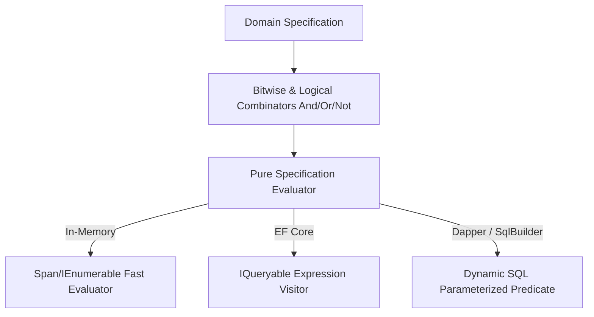

# Level 00: Architectural Introduction & Mental Model

## 1. Overview & Problem Statement
The Specification Pattern encapsulates domain logic predicates into reusable, combinable business rules. However, legacy specification implementations suffer from:
- **Expression Re-compilation Overhead**: Repeatedly invoking `Expression.Compile()` introduces severe CPU overhead and Gen 0 heap allocations.
- **Native AOT Incompatibility**: Compiling dynamic expression trees into IL delegates fails entirely under .NET Native AOT compilation.
- **Provider Leaks**: Specifications tightly coupled to EF Core leak infrastructure concerns into the core Domain layer.

`EricksonLopez.Specification` solves these challenges with a **High-Performance, Zero-Reflection Specification Engine**:
- **Compiled Query Reusability**: Pre-compiled and cached predicate evaluators.
- **100% Native AOT Compatible**: Native LINQ-compatible evaluators that execute safely under IL trimming.
- **Seamless Provider Adapters**: First-class evaluators for In-Memory collections, EF Core, Dapper, and SQL Builders.

---

## 2. Specification Evaluation Architecture

---

## 3. High-Level Comparison

| Capability | Ardalis.Specification | Generic Predicate Funcs | EricksonLopez.Specification |
|---|---|---|---|
| **Domain Purity** | ⚠️ Tied to EF Core conventions | ❌ Unnamed closures | ✅ **Pure Domain Aggregates** |
| **Native AOT Trimmable** | ❌ Dynamic compilation | ⚠️ Partial | ✅ **100% Guaranteed Native AOT** |
| **Logical Composition** | Basic boolean chaining | Manual binary expressions | **Strongly-Typed AST Combinators** |
| **Memory Allocation** | Expression node churn | Delegate allocation | **Zero-Allocation Cached Evaluators** |
