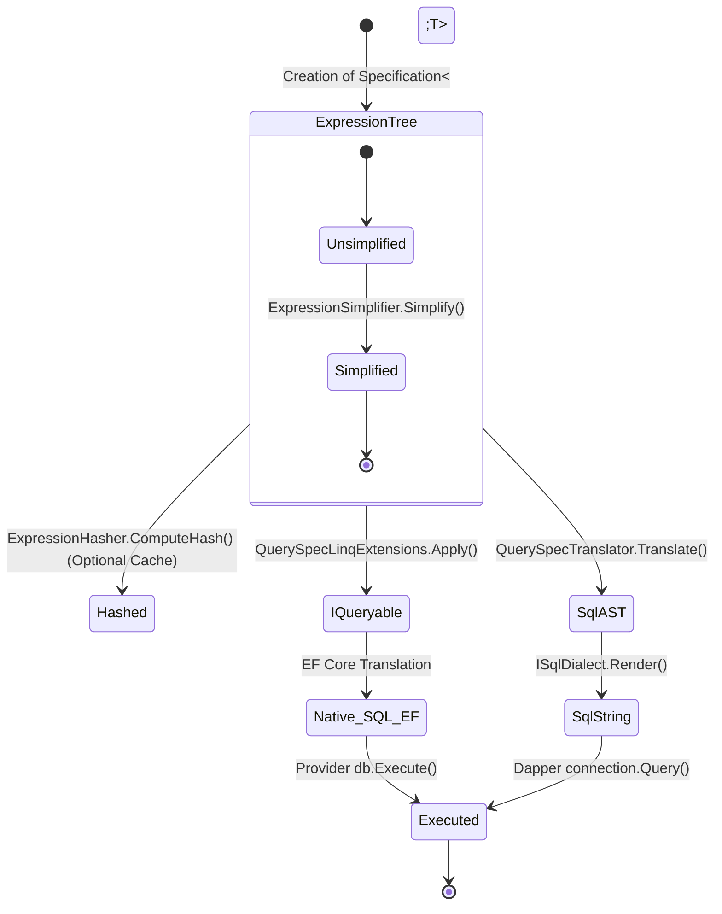

# System Overview

This document provides a comprehensive overview of the `EricksonLopez.Specification` system, combining architectural guidelines, design decisions, and functional mapping.

> **Principle**: A Specification expresses *what* to query. Providers decide *how* to execute it.

---

## 1. Executive Summary

EricksonLopez.Specification is a **composable, AOT-first, provider-agnostic predicate and query descriptor library** multi-targeting .NET 8 and .NET 10.

**Three non-negotiable design constraints**:

| Constraint | Consequence |
|---|---|
| Native AOT first | `ExpressionInterpreter` is the default evaluator. `Expression.Compile()` is opt-in JIT-only. |
| Dapper/SQL-first | Expression trees translate to SQL without EF Core. |
| DDD correct | `Specification<T>` is predicate-only. `QuerySpec<T>` carries query concerns. |

---

## 2. What It IS vs IS NOT

### IS
- Encapsulates a business rule as an immutable `Expression<Func<T, bool>>`
- Composes predicates (And/Or/Not) without `Expression.Invoke`
- Evaluates predicates in-memory (AOT-safe via `ExpressionInterpreter`)
- Describes queries as an immutable value object (`QuerySpec<T>`)
- Translates queries to `IQueryable<T>` (EF Core path)
- Translates queries to parameterized SQL strings (Dapper path)
- Enforces architectural boundaries via Roslyn analyzers

### IS NOT (Hard Boundaries)
- ORM / Query Executor
- Write Repository (adr-001)
- Pagination / Validation Framework
- Include / ThenInclude provider (adr-002)

---

## 3. General Architecture Flow

This diagram shows how a `Specification<T>` travels from the Domain layer, is packaged into a `QuerySpec<T>` in the Application layer, and is finally translated by the Infrastructure, either using LINQ (EF Core) or Native SQL (Dapper).

```mermaid
flowchart TD
    %% Architecture Layers
    subgraph Domain["Domain Layer"]
        Spec[Specification&lt;T&gt;]
        SpecDesc["Contains Pure Rule (Expression)"]
        Spec --- SpecDesc
    end

    subgraph Application["Application Layer"]
        QuerySpec[QuerySpec&lt;T&gt;]
        QueryDesc["Adds Sorting and Pagination"]
        QuerySpec --- QueryDesc
    end

    subgraph CoreEngine["Specification Engine"]
        Composer[ExpressionComposer]
        Simplifier[ExpressionSimplifier]
        Hasher[ExpressionHasher]
    end

    subgraph Infrastructure["Infrastructure Layer"]
        direction LR
        subgraph LinqProvider["LINQ Provider (EF Core)"]
            ApplyExt[QuerySpecLinqExtensions.Apply]
            IQueryable[IQueryable&lt;T&gt;]
        end
        subgraph SqlProvider["SQL Provider (Dapper)"]
            Translator[QuerySpecTranslator&lt;T&gt;]
            QueryModel[QueryModel AST]
            Dialect[ISqlDialect]
            SqlQuery[SqlQuery String]
        end
    end

    %% Relationships
    Spec -->|.And() / .Or()| Composer
    Composer --> Simplifier
    Simplifier --> QuerySpec
    Spec -->|Direct| QuerySpec
    
    QuerySpec -->|LINQ Usage| ApplyExt
    ApplyExt --> IQueryable
    IQueryable -->|LINQ Provider| Database[(Database)]

    QuerySpec -->|SQL Usage| Translator
    Translator -->|Translates| QueryModel
    QueryModel -->|Renders| Dialect
    Dialect --> SqlQuery
    SqlQuery -->|Executes (Dapper)| Database
```

---

## 4. Domain Specification vs Query Specification

| Property | `Specification<T>` | `QuerySpec<T>` |
|---|---|---|
| **Layer** | Domain | Application |
| **Contains** | Pure predicate `Expression<Func<T,bool>>` | Filter + Order + Pagination + Flags |
| **Evaluatable in-memory** | Yes | Only via LINQ after extraction |
| **Database-aware** | No | Yes (provider interprets flags) |
| **Knows ordering** | Never | Yes |
| **Knows pagination** | Never | Yes |

---

## 5. State Machine (Expression Lifecycle)

This state diagram shows in what form the logical expression travels through the pipeline.



---

## 6. SQL Resolution Sequence Diagram

Demonstrates the step-by-step process of translating a `QuerySpec` into parameterized SQL, without relying on heavy runtime reflection.

```mermaid
sequenceDiagram
    participant App as Application Handler
    participant Spec as QuerySpec&lt;T&gt;
    participant Trans as QuerySpecTranslator
    participant AST as QueryModel
    participant Dialect as PostgreSqlDialect
    participant DB as Database (Dapper)

    App->>Spec: 1. Instantiate with rules (Where, OrderBy)
    App->>Trans: 2. Translate(Spec)
    activate Trans
    Trans->>Spec: 3. Read Expressions (Criteria, OrderClauses)
    Trans->>Trans: 4. Transform Expressions to AST (SqlPredicateNode)
    Trans-->>AST: 5. Return QueryModel
    deactivate Trans
    
    App->>Dialect: 6. Render(QueryModel)
    activate Dialect
    Dialect->>Dialect: 7. Traverse AST and generate Safe SQL String
    Dialect-->>App: 8. Return SqlQuery (SQL + Parameters)
    deactivate Dialect
    
    App->>DB: 9. connection.QueryAsync(SqlQuery.Sql, SqlQuery.Parameters)
    DB-->>App: 10. Return Entities
```

---

## 7. AOT / Trimming Policy

| Component | AOT | Notes |
|---|---|---|
| `Specification<T>` (base) | Full | Lazy<T>, no dynamic code |
| `ExpressionComposer` | Full | Pure expression manipulation |
| `ExpressionSimplifier` | Full | ExpressionVisitor, BCL |
| `ExpressionHasher` | Full | struct HashCode |
| `ExpressionInterpreter` | Compatible w/ annotations | PropertyInfo.GetValue -> `[DynamicallyAccessedMembers]` |
| `ExpressionCompilationCache` | JIT-only | `[RequiresDynamicCode]` annotated |
| `QuerySpec<T>` | Full | Sealed record, ImmutableArray |
| `QuerySpecLinqExtensions` | Full | Passes expr to provider |
| `QuerySpecTranslator<T>` | Partial | FieldInfo.GetValue -> `[RequiresUnreferencedCode]` |
| `ISqlDialect.Render()` | Full | Pure string building |
| Analyzers | Full | Compile-time only |

**Forbidden in AOT path**: `Reflection.Emit`, dynamic types, unannotated `PropertyInfo.GetValue`.

---

## 8. Component Dependencies (Package Diagram)

Shows the physical and conceptual separation of the library's projects (Clean Architecture AOT).

```mermaid
classDiagram
    class EricksonLopez_Specification_Abstractions {
        +QuerySpec&lt;T&gt;
        +ISpecification&lt;T&gt;
        +IReadRepository&lt;T&gt;
    }
    
    class EricksonLopez_Specification {
        +Specification&lt;T&gt;
        +ExpressionComposer
        +ExpressionSimplifier
        +ExpressionHasher
        +ExpressionInterpreter
    }

    class EricksonLopez_Specification_Linq {
        +QuerySpecLinqExtensions
    }

    class EricksonLopez_Specification_Sql {
        +QueryModel
        +ISqlDialect
        +QuerySpecTranslator&lt;T&gt;
        +QueryPlanCache
    }

    class EricksonLopez_Specification_PostgreSql {
        +PostgreSqlDialect
    }

    class EricksonLopez_Specification_MsSql {
        +MsSqlDialect
    }

    class EricksonLopez_Specification_MySql {
        +MySqlDialect
    }

    class EricksonLopez_Specification_MariaDb {
        +MariaDbDialect
    }

    class EricksonLopez_Specification_Sqlite {
        +SqliteDialect
    }

    class EricksonLopez_Specification_Oracle {
        +OracleDialect
    }

    class EricksonLopez_Specification_Dapper {
        +QuerySpecDapperExtensions
    }

    class EricksonLopez_Specification_EntityFrameworkCore {
        +SpecificationEvaluator
        +EfRepository&lt;T&gt;
    }

    class EricksonLopez_Specification_MongoDB {
        +MongoFilterCompiler
        +MongoSortCompiler
        +MongoSpecificationExtensions
    }

    class EricksonLopez_Specification_DapperExtensions {
        +DapperExtensionsIntegration
    }

    class EricksonLopez_Specification_Result {
        +ReadRepositoryResultExtensions
    }

    EricksonLopez_Specification --> EricksonLopez_Specification_Abstractions
    EricksonLopez_Specification_Linq --> EricksonLopez_Specification_Abstractions
    EricksonLopez_Specification_Sql --> EricksonLopez_Specification
    EricksonLopez_Specification_PostgreSql --> EricksonLopez_Specification_Sql
    EricksonLopez_Specification_MsSql --> EricksonLopez_Specification_Sql
    EricksonLopez_Specification_MySql --> EricksonLopez_Specification_Sql
    EricksonLopez_Specification_MariaDb --> EricksonLopez_Specification_Sql
    EricksonLopez_Specification_Sqlite --> EricksonLopez_Specification_Sql
    EricksonLopez_Specification_Oracle --> EricksonLopez_Specification_Sql
    EricksonLopez_Specification_Dapper --> EricksonLopez_Specification_Sql
    EricksonLopez_Specification_EntityFrameworkCore --> EricksonLopez_Specification_Abstractions
    EricksonLopez_Specification_EntityFrameworkCore --> EricksonLopez_Specification_Linq
    EricksonLopez_Specification_MongoDB --> EricksonLopez_Specification_Abstractions
    EricksonLopez_Specification_MongoDB --> EricksonLopez_Specification_Linq
    EricksonLopez_Specification_DapperExtensions --> EricksonLopez_Specification
    EricksonLopez_Specification_DapperExtensions --> EricksonLopez_Specification_Sql
    EricksonLopez_Specification_Result --> EricksonLopez_Specification_Abstractions
```



No circular dependencies. Zero upward dependencies.

