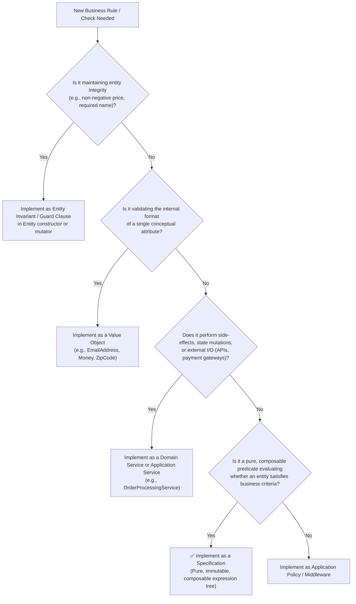

<!-- Copyright © Erickson Lopez. MIT License. -->
# When to Use the Specification Pattern in DDD

## Overview

In Domain-Driven Design (DDD), the **Specification Pattern** encapsulates business rules as first-class domain objects that can be combined, evaluated in-memory, and translated into persistent queries.

However, a common architectural defect in enterprise software is overusing specifications for concerns better served by other DDD building blocks. This document outlines clear architectural boundaries between **Specifications**, **Entity Invariants**, **Value Objects**, **Domain Services**, and **Application Policies**.

---

## Strategic Decision Matrix

| Architectural Concern | Primary Responsibility | Primary DDD Pattern | Should You Use a `Specification<T>`? |
|---|---|---|:---:|
| **Entity Invariants** | Ensuring an entity never enters an invalid state at construction or mutation time | Encapsulation & Guard Clauses in Entity | ❌ **No** (Violates entity encapsulation) |
| **Attribute Validation** | Structural validation of properties (email format, string lengths, currency bounds) | **Value Object** self-validation | ❌ **No** (Belongs inside Value Object constructor) |
| **Domain Predicate** | Business rule stating whether an entity satisfies a specific domain condition | **`Specification<T>`** | ✅ **Yes** (Ideal use case) |
| **Query Filtering** | Filtering database sets by domain business conditions | **`QuerySpec<T>`** + `Specification<T>` | ✅ **Yes** (Translates to parameterized SQL / LINQ) |
| **Complex Multi-Entity Operation** | State mutation involving multiple aggregates or external infrastructure | **Domain Service** | ❌ **No** (Specifications are pure side-effect-free predicates) |
| **Workflow / Orchestration** | Security checks, permissions, UI workflows, temporal jobs | **Application Policy / Pipeline** | ❌ **No** (Belongs in Application Layer) |

---

## Architectural Decision Flowchart



---

## Detailed Comparisons

### 1. Specification vs. Entity Invariant

An **invariant** is a business rule that must always hold true for an aggregate or entity throughout its entire lifecycle.

- **Entity Invariant**: An order line must never have a quantity $\le 0$. If an order line has quantity $\le 0$, the aggregate is invalid and corrupted. Invariants must be enforced inside the entity's constructor and mutating methods.
- **Specification**: An order qualifies for express priority shipping if total amount $> \$500$ and customer tier is VIP. An order with total amount of $\$100$ is perfectly valid; it simply does not satisfy the priority specification.

```csharp
// ❌ WRONG: Using a specification to enforce an entity invariant
public sealed class ValidOrderLineQuantitySpec : Specification<OrderLine>
{
    protected override Expression<Func<OrderLine, bool>> BuildExpression()
        => line => line.Quantity > 0;
}

// ✅ CORRECT: Invariant enforced directly within the Entity
public sealed class OrderLine
{
    public int Quantity { get; private set; }

    public OrderLine(int quantity)
    {
        if (quantity <= 0)
            throw new ArgumentOutOfRangeException(nameof(quantity), "Quantity must be greater than zero.");
        Quantity = quantity;
    }
}
```

---

### 2. Specification vs. Value Object

A **Value Object** is defined by its attributes and carries intrinsic validation for structural integrity and format.

- **Value Object**: Validating whether an email contains an `@` sign or whether a PostalCode matches a regulatory format belongs in the `EmailAddress` or `PostalCode` Value Object.
- **Specification**: Checking whether an existing `Customer` with a valid `EmailAddress` belongs to an approved enterprise domain (`@acme.corp`) for a discount promotion belongs in a `Specification<Customer>`.

```csharp
// ❌ WRONG: Validating value object formatting with a specification
public sealed class ValidEmailAddressSpec : Specification<string>
{
    protected override Expression<Func<string, bool>> BuildExpression()
        => email => email.Contains("@");
}

// ✅ CORRECT: Value object self-validates on construction
public sealed record EmailAddress
{
    public string Value { get; }

    public EmailAddress(string value)
    {
        ArgumentException.ThrowIfNullOrWhiteSpace(value);
        if (!value.Contains('@'))
            throw new ArgumentException("Invalid email format.", nameof(value));
        Value = value;
    }
}
```

---

### 3. Specification vs. Domain Service

A **Domain Service** performs domain operations that do not naturally belong to a single entity or that coordinate operations across multiple aggregates.

- **Domain Service**: Rebalancing bank accounts, calculating tax via an external lookup service, or debiting credit cards.
- **Specification**: A pure boolean condition evaluated over entity state (e.g. `Spec.For<Account>(a => a.Balance >= minimumBalance)`). Specifications must never trigger network requests, database side-effects, or mutate entity state.

```csharp
// ❌ WRONG: Specification executing side-effects or external calls
public sealed class AccountCanWithdrawSpec : Specification<Account>
{
    protected override Expression<Func<Account, bool>> BuildExpression()
    {
        // Calling an external service or mutating state inside a specification is strictly prohibited!
        return a => ExternalFraudDetectionApi.IsClear(a.Id) && a.Balance > 0;
    }
}

// ✅ CORRECT: Pure domain predicate in Specification; orchestration in Domain Service
public sealed class AccountSufficientFundsSpec : Specification<Account>
{
    private readonly decimal _amount;
    public AccountSufficientFundsSpec(decimal amount) => _amount = amount;

    protected override Expression<Func<Account, bool>> BuildExpression()
        => account => account.Balance >= _amount && account.Status == AccountStatus.Active;
}
```

---

## When to Choose `Specification<T>` in EricksonLopez.Specification

Choose `Specification<T>` when:

1. **Reusability**: The same business predicate is needed in multiple application use cases or repository queries.
2. **Composition**: The rule needs to be combined dynamically using boolean logic (`&`, `|`, `!`, `Spec.All`, `Spec.Any`).
3. **Dual Execution**: The same rule must execute both in database SQL queries (`IQueryable.Apply`) and in-memory (`specification.IsSatisfiedBy(entity)`).
4. **Native AOT Safety**: In-memory evaluation must run on Native AOT without generating runtime IL or relying on reflection.
5. **Architectural Clarity**: The rule represents a distinct business concept that deserves a descriptive, sealed class name (e.g., `EligibleForAnnualLoyaltyDiscountSpecification`).
